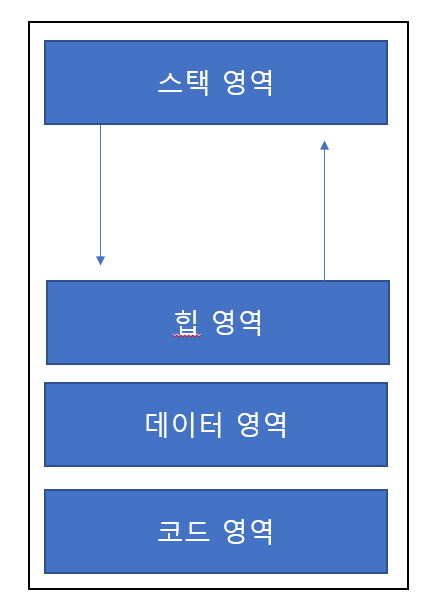

# 4주차

    TIP
    어려운데 굉장히 중요한 부분이라고 한다

## 프로세스의 정의 

+ 1960년대 멀릭스 운영체제에서 처음 사용
+ IBM 운영체제에서의 작업
+ 실행중인 프로그램
+ 비동기적 행위
+ 실행중인 프로시저
+ 실행중인 프로시저의 제어 추적
+ 운영체제에 들어 있는 프로세스 제어 블록[PCB]
+ 프로세서에 할당하여 실행할 수 있는 개체 디스패치가 가능한 대상

_

    TIP
    프로그램이 메모리로 적재되면 프로세스가 됨

## 프로세스의 일반적 메모리구조

+ 독립적 실행
    + 명령어가 순차적으로 실행되는 것

## 코드 영역
실행 할 프로그램의 코드가 저장되는 공간으로 CPU는 이 영역에 저장된 명령문을 가져간다
## 데이터 영역
전역변수와 static변수가 할당된다 

이 영역에 할당되는 변수들은 시작과 동시에 메모리 공간에 할당되며 프로그램이 종료할 때 까지 남아있는다
## 스택 영역

지역변수와 매개변수가 할당된다

이 영역에 할당된 변수는 선언된 위치의 함수를 빠져나갈 경우 소멸된다

## 힙 영역

알고리즘을 짜다보면 프로그래머가 원하는 시점에 변수를 할당하고 해제하고 싶을 때가 있다(주로 malloc과 free를 사용할 때)

이 경우에 변수가 할당되는 영역이 힙 영역이다

---

## 시스템 관점에서의 프로세스

알아보기 [이건 조사해보자]

## 프로세스의 종류

+ 역할

    + 시스템(커널) 프로세스

        + 모든 시스템 메모리와 프로세서의 명령에 엑세스 할 수 있는 프로세스이다.
        + 프로세스 실행 순서를 제어하거나 다른 사용자 및 커널운영체제 영역을 침범하지 못하게 감시하고, 사용자 프로세스를 생성하는 기능을 한다.

    + 사용자 프로세스

        + 사용자 코드를 수행하는 프로세스이다.

+ 병행 수행방법

    + 독립 프로세스

        + 다른 프로세서에 영향을 주지 않거나, 다른 프로세스의 영향을 받지 않으면서 수행함

    + 협력 프로세스

        + 다른 프로세스에 영향을 주거나 영향을 받으면서 수행함

---

    사용자 모드 -> 커널 모드로 변환할 때 보안 인증을함

## 프로세스의 상태 변화

    시험에 나온다 책에서 정확하게 외워놓자
    (해당 이미지가 있음)

## 프로세스의 상태 변화와 상태 정보

+ 프로세스의 상태 변화는 운영체제가 프로세서 스케줄러 이용하여 관리
+ 작업 스케줄러는 스플러가 디스크에 저장한 작업 중 실행할 작업 선정하고 준비 리스트에 삽입하여 다중 프로그래밍의 정도 결정
+ 프로세스 스케줄러는 선정한 작업의 상태를 변화시키며 프로세스의 생성에서 종료까지 과정 수행

스케줄링, 스케줄러 : 운영체제가 프로세스를 관리하는 정책

+ 문맥교환 알아보기

_

    TIP
    정말로 중요한 부분이다
    책을보면서 100번 외워두자

### 3가지 상태
+ 실행
+ 준비
+ 대기

상상도 못할정도로 빨라서 멀티태스킹이 가능함

+ 멀티태스킹 : 동시에 수행하는것처럼 보이게 존나 빠르다

+ 멀티프로그램이 확장된게 멀티태스킹

+ 모두 동적인 프로세서를 장착함

### 우선순위스케줄러, 라운드스케줄러

+ 준비 -> 실행

    dispatch

+ 실행 -> 준비

    timeout

+ 실행 -> 대기

    block

+ 대기 -> 준비

    wakeup

### 프로세스 문맥교환

+ 실행 중인 프로세스의 제어를 다른 프로세스에 넘겨 실행 상태가 되도록 하는것
+ 프로세스 문맥 교환이 일어나면 프로세서의 레지스터에 있던 내용 저장

## 프로세스의 구조

## 프로세스의 생성 시기

## 프로세스 생성시 필요한 세부 작업 순서

## 프로세스가 새로운 프로세스 생성 시 다음 두 가지 실행 발생

+ 부모 프로세스와 자식 프로세스 동시 실행
+ 부모 프로세스는 자식 프로세스 모두 종료할 때까지 대기
+ 프로세스를 부모 프로세스가 띄우는 트리구조

## 프로세스 제거

+ 프로세스 파괴

## 프로세스 중단
 
+ 시스템의 유휴시간 문제를 프로세스 중단(일시정지) 상태를 이용 해결
+ 중단한 프로세스는 중단한 지점부터 다시 시작
+ 다중 프로그래밍에서 중단
+ 다중 처리 시스템, 다른 프로세서가 실행 중인 프로세스 중단
+ 중단된 프로세스는 다른 프로세서가 재시작 하기전에 실행 불가
+ 하 존나 많음(책으로 보면됨)
