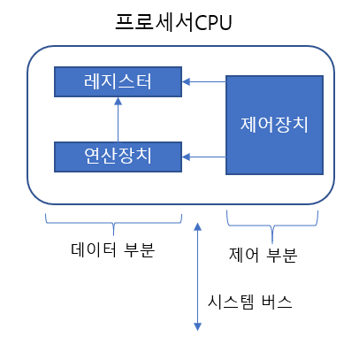

# CPU에 대해 알아보자

CPU는 프로세서라고 불리기도 하며 컴퓨터 하드웨어에 부착한 모든 장치의 동작을 제어하고 명령을 실행한다.

# 레지스터 뽀개버리기

프로세서에 위치한 고속 메모리로 극히 소량의 데이터나 처리중인 중간 결과와도 같은 프로세서가 바로 사용할 수 있는 데이터를 담고 있는 영역

용도에 따라서 사용자 가시 레지스터/ 사용자 불가시 레지스터로 구분된다.

## 사용자 가시 레지스터

사용자가 운영체제와 사용자 프로그램을 이용하여 정보를 변경할 수 있는 레지스터

    데이터 레지스터[DR - Data Register]

         함수 연산에 필요한 데이터를 저장한다.
         산술연산&논리연산에 사용, 연산 결과로 플래그 값을 저장한다.

    주소 레지스터[AR - Address Register]

        기준 주소 레지스터

            프로그램을 실행할 때 사용하는 기준 주소 값

        인덱스 레지스터

            유효 주소를 계산하는데 사용하는 주소 정보를 저장한다.

        스택 포인터 레지스터

            메모리에 프로세서 스택을 구현하는데 사용
            프로세서와 주소 레지스터를 데이터 스택포인터, 큐에 저장한다.
            보통 반환 주소, 프로세서 상태 정보, 서브루틴의 임시 변수를 저장한다.

## 사용자 불가시 레지스터

사용자가 정보를 변경할 수 없는 레지스터로 프로세서의 상태와 제어를 관리

    프로그램 카운터[PC - Program Counter]

        다음에 실행할 명령어의 주소를 보관
        계수기로 되어 있어서 실행할 명령어를 메모리에서 읽으면 명령어의 길이만큼 증가함
        그 후에 다음 명령어를 가리키고 분기 명령어는 목적 주소로 갱신이 가능

    명령어 레지스터[IR - Instruction Register]

        현재 실행하는 명령어를 보관함

    누산기[ACC - ACCumulator]

        데이터를 일시적으로 저장하는 레지스터

    메모리 주소 레지스터[MAR - Memory Adress Register]

        프로세서가 참조하려는 데이터의 주소를 명시
        메모리에 접근하는 버퍼 레지스터

    메모리 버퍼 레지스터[MBR - Memory Buffer Register]

        프로세서가 메모리에서 읽거나 메모리에 저장할 데이터 자체를 보관하는 버퍼 레지스터
        메모리 데이터 레지스터라고도한다.

## 메모리 계층 구조

    속도/가격 : 보조기억장치 < 메인 메모리 < 캐시 < 레지스터

    용랑 : 보조기억장치 > 메인 메모리 > 캐시 > 레지스터

여기서 알아야 할게 있다.

그게 뭐냐면 레지스터, 캐시, 메인 메모리는 프로세서가 프로그램과 데이터에 직접 접근할 수 있는데,

보조기억장치는 프로그램과 데이터를 메인 메모리에 옮겨야 실행할 수 있다.