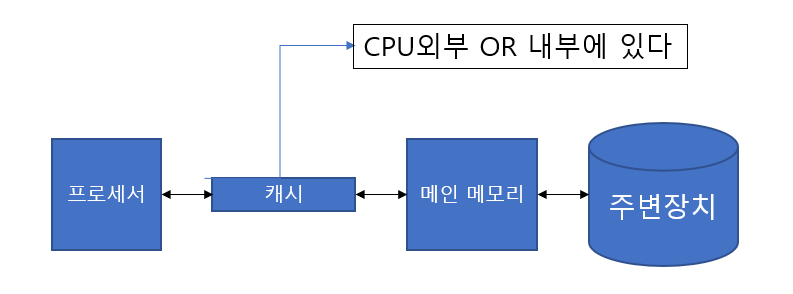
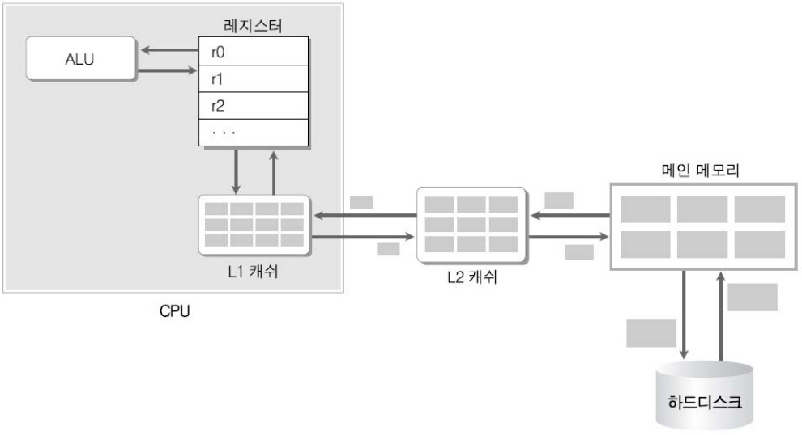
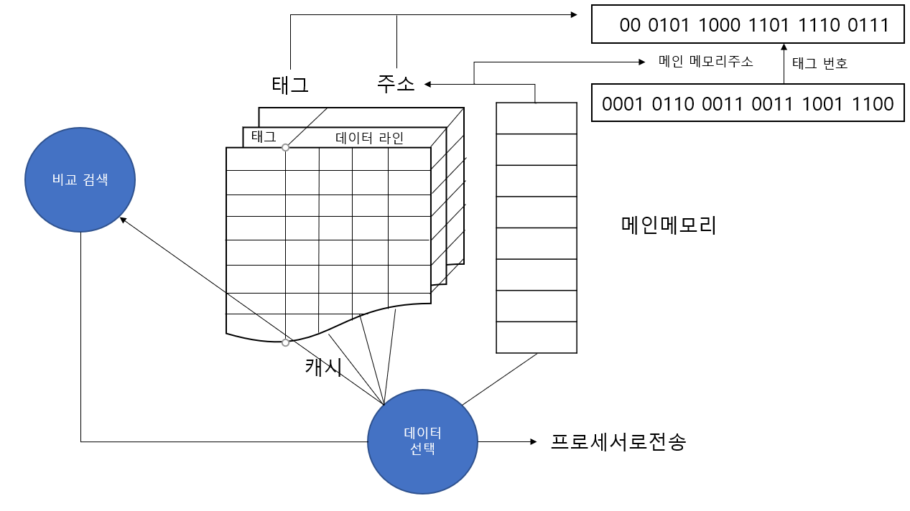

# CPU에 대해 알아보자

CPU는 프로세서라고 불리기도 하며 컴퓨터 하드웨어에 부착한 모든 장치의 동작을 제어하고 명령을 실행한다.

# 레지스터 뽀개버리기

프로세서에 위치한 고속 메모리로 극히 소량의 데이터나 처리중인 중간 결과와도 같은 프로세서가 바로 사용할 수 있는 데이터를 담고 있는 영역

용도에 따라서 사용자 가시 레지스터/ 사용자 불가시 레지스터로 구분된다.

## 사용자 가시 레지스터

사용자가 운영체제와 사용자 프로그램을 이용하여 정보를 변경할 수 있는 레지스터

    데이터 레지스터[DR - Data Register]

         함수 연산에 필요한 데이터를 저장한다.
         산술연산&논리연산에 사용, 연산 결과로 플래그 값을 저장한다.

    주소 레지스터[AR - Address Register]

        기준 주소 레지스터

            프로그램을 실행할 때 사용하는 기준 주소 값

        인덱스 레지스터

            유효 주소를 계산하는데 사용하는 주소 정보를 저장한다.

        스택 포인터 레지스터

            메모리에 프로세서 스택을 구현하는데 사용
            프로세서와 주소 레지스터를 데이터 스택포인터, 큐에 저장한다.
            보통 반환 주소, 프로세서 상태 정보, 서브루틴의 임시 변수를 저장한다.

## 사용자 불가시 레지스터

사용자가 정보를 변경할 수 없는 레지스터로 프로세서의 상태와 제어를 관리

    프로그램 카운터[PC - Program Counter]

        다음에 실행할 명령어의 주소를 보관
        계수기로 되어 있어서 실행할 명령어를 메모리에서 읽으면 명령어의 길이만큼 증가함
        그 후에 다음 명령어를 가리키고 분기 명령어는 목적 주소로 갱신이 가능

    명령어 레지스터[IR - Instruction Register]

        현재 실행하는 명령어를 보관함

    누산기[ACC - ACCumulator]

        데이터를 일시적으로 저장하는 레지스터

    메모리 주소 레지스터[MAR - Memory Adress Register]

        프로세서가 참조하려는 데이터의 주소를 명시
        메모리에 접근하는 버퍼 레지스터

    메모리 버퍼 레지스터[MBR - Memory Buffer Register]

        프로세서가 메모리에서 읽거나 메모리에 저장할 데이터 자체를 보관하는 버퍼 레지스터
        메모리 데이터 레지스터라고도한다.

## 메모리 계층 구조

    속도/가격 : 보조기억장치 < 메인 메모리 < 캐시 < 레지스터

    용랑 : 보조기억장치 > 메인 메모리 > 캐시 > 레지스터

여기서 알아야 할게 있다.

그게 뭐냐면 레지스터, 캐시, 메인 메모리는 프로세서가 프로그램과 데이터에 직접 접근할 수 있는데,

보조기억장치는 프로그램과 데이터를 메인 메모리에 옮겨야 실행할 수 있다.

# 메인 메모리(RAM)

프로세서(CPU)외부에 있고, 프로세서에서 즉각적으로 수행할 프로그램과 데이터를 저장하거나 프로세서에서 처리한 결과를 메인 메모리에 저장한다

주기억장치 또는 1차기억장치라고함  저장 밀도가 높고 가격이 싼 DRAM을 많이 사용한다.

    프로세서 <----> 메인 메모리 <----> 주변장치

    1. 다수의 셀로 구성된다.

    2. 셀 K비트이면 셀은 2의 k승값을 저장할 수 있다.

    3. RAM에 저장할 때는 데이터를 셀에 나눠서 저장한다.

    4. 셀은 주소로 참조하는데 n비트이라면 주소의 범위는 0~2의 n-1승이다.

    5. 메모리 매핑 : 프로그래밍으로 생성된 논리적 주로를 메인메모리에 실제 주소로 옮기는 과정

## 메모리 속도 표현법

메모리 속도는 메모리 접근시간과 메모리 사이클 시간으로 표현이 가능하다.

1. 메모리 접근시간

        명령이 발생한 후 목표 주소를 검색하여 데이터 쓰기(읽기)를 시작할 때까지 걸린 시간
        ex) 읽기 제어 신호를 가한 후 데이터를 메모리 버퍼 레지스터에 저장할 때까지 걸린시간

2. 메모리 사이클 시간

        두 번의 연속적인 메모리 동작 사이에 필요한 최소 지연시간
        ex) 읽기 제어 신호를 가한 후 다음 읽기 제어 신호를 가할 수 있을 때까지 필요한 시간

**보통 사이클 시간이 접근 시간보다 약간 길며, 메모리의 세부 구현 방법에 따라 다르다.

## 알아야할 것

메인 메모리는 프로세서와 보조기억장치 사이에 있으며, 여기에 발생하는 디스크 입출력 병목 현상을 해결하는 역할도 한다.

그런데 프로세서와 메인 메모리 간에 속도 차이가 나면서 메인 메모리의 부담을 줄이려고 프로세서 외부나 내부에 캐시를 구현하기도 한다.

마치 이렇게 말이다

# 캐시 뽀사버리기

일단 여기서 캐시는 돈이 아니다.(not 캐쉬)

프로세서 내부나 외부에 있으며, 처리 속도가 빠른 프로세서와 상대적으로 느린 메인 메모리의 속도차이를 보완하는 고속 버퍼이다.

메인 메모리에서 데이터를 블록 단위로 가져와 프로세서에 워드 단위로 전달하여 속도를 높인다.

데이터가 이동하는 통로(대역폭)를 확대하여 프로세서와 메모리의 속도 차이를 줄인다.

[메인 메모리와 크기가 동일한 블록 여러 개로 구성되는데, 보통 8~64바이트 정도의 블록이다.]

## 캐시의 동작에 대해 알아버리기

우선 캐시는 주소 영역을 한 번 읽어 들일 수 있는 크기로 나눈 후에 각 블록에 번호를 부여하여 이 번호를 태그로 저장한다.

## 순서

1. 프로세서는 메인 메모리에 접근하기 전에 캐시에 해당주소가 있는지 먼저 확인함

2. 접근하려는 주소 24비트 중에 태그에 해당하는 처음 22비트를 캐시의 모든라인과 비교

3. 일치하는 라인이 있다!!

4. 그러면 주소의 나머지 2비트(00)를 이용하여 데이터 라인의 4개 (00,01,10,11) 바이트 중 해당하는 바이트를 가져온다.

## 캐시의 성능을 좌우하는 법

간단하게 말하면 작은 용량의 캐시에 프로세서가 이후 참조할 정보가 얼마나 들어 있느냐로 좌우된다.

일단 알아야할 두가지 가 있다.

1. 캐시 적중(cache hit)

        프로세서가 참조하려는 정보가 있을 때

2. 캐시 실패(cache miss)

        반대로 프로세서가 참조하려는 정보가 없을 때

여기서 캐시의 성능은 블록의 크기로 좌우된다.

그 이유는 프로그램이 실행할 때 참조한 메모리에 대한 공간적 지역성과 시간적 지역성이 있기 때문

1. 공간적 지역성이란?

        대부분의 프로그램이 참조한 주소와 인접한 주소의 내용을 다시 참조하는 특성

2. 시간적 지역성이란?

        한 번 참조한 주소를 곧 다시 참조하는 특성

## 위에 두가지가 나타나는 이유는?

* 프로그램이 명령어를 순차적으로 실행하는 경향이 있어 명령어가 특정 지역 메모리에 인정해 있다.

* 순환(단일순환, 중첩순환 등) 때문에 프로그램을 반복하더라도 메모리는 일부 영역만 참조한다.

* 대부분의 컴파일러를 메모리에 인접한 블록에 배열로 저장한다. 따라서 프로그램이 배열 원소에 순차적으로 자주 접근하므로 지역적인 배열 접근 경향이 있다.

# 보조기억장치

2차 기억장치 또는 외부기억장치라도 한다.

자기디스크 광디스크 자기테이프 등이 있다.

# 시스템 버스

하드웨어를 물리적으로 연결하여 서로 데이터를 주고받을 수 있게 하는 통로로 기능에 따라 구분된다.

## 시스템 버스를 기능에 따라 구분해보자

1. 데이터 버스

        프로세서와 메인 메모리, 주변장치 사이에서 데이터를 전송한다. 데이터 버스를 구성하는 배선 수는 프로세서가 한 번에 전송할 수 있는 비트 수를 결정하는데, 이를 워드라고한다.

2. 주소 버스

        프로세서가 시스템의 구성 요소를 식별하는 주소 정보를 전송한다. 주소 버스를 구성하는 배선 수는 프로세서와 접속할 수 있는 메인 메모리의 최대 용량을 결정한다.

3. 제어 버스

        프로세서가 시스템의 구성 요소를 제어하는데 사용한다. 제어 신호로 연산장치의 연산 종류와 메인 메모리의 읽기나 쓰기 동작을 결정한다.

# 주변장치

입력장치, 출력장치, 저장장치로 구분한다.