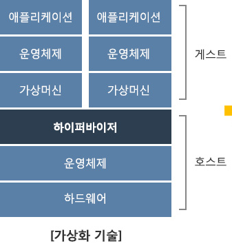
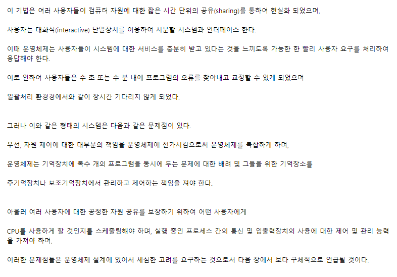
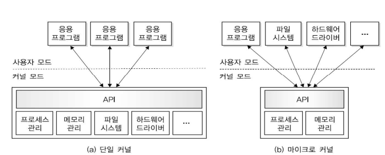

# 운영체제에 대해 알아보자

운영체제는 사용자가 응용 프로그램을 실행할 수 있는 기반 환경을 제공하여
컴퓨터를 편리하게 사용할 수 있도록 도와주고, 하드웨어를 효율적으로 사용할 수 있도록
다양한 기능을 제공하는 소프트웨어이다.

+ 사용자

    작업을 하려는 캄퓨터를 사용하는 사람이나 장치, 다른 컴퓨터를 의미한다.

+ 소프트웨어

    컴퓨터가 기능을 수행하는데 필요한 모든 프로그램을 의미한다.
    
    구성요소
        
    + 시스템 소프트웨어

            컴퓨터 자원을 관리하고 응용프로그램의 실행을 지원하여
            컴퓨터를 제어하는 프로그램
            운영체제를 비롯해 장치 드라이버로 구성된다.

    + 유틸리티

            우선 응용프로그램보다 작다
            컴퓨터의 여러 처리 과정을 보조하여 시스템을 유지하고 성능을 개선하는 프로그램
            운영체제를 돕는 역할을함
            필요에 따라 사용자&운영체제가 메모리 상주 프로그램으로 설치하기도 함

    + 응용 프로그램

            특정작업을 수행하기 위해 사용자나 전문가가 만든 프로그램
            웹 브라우저, 게임, 이미지편집프로그램 등이 이에 해당함

+ 하드웨어

    기본 연산 자원을 제공하는 프로세서(CPU), 메모리, 주변장치 등으로 구성

---
    TIP
    운영체제는 다양한 응용 프로그램이 하드웨어,
    즉 컴퓨터 자원을 효율적으로 사용할 수 있도록 관리하고 조정하는 역할을 한다.

## 컴퓨터 자원관리 측면에서 운영체제의 역할

+ 조정자

    다른 프로그램이 작업할 수 있는 환경만 제공할 뿐 직접 일을 하지는 못하는 조정자 역할 수행

+ 자원 할당자나 관리자

    + 각 응용 프로그램이 필요로 하는 자원을 할당해주는 자원 할당자 역할 수행

    + 자원이란?

            사용자가 실행하고자 하는 프로그램이 필요로 하는 모든 것
            ex) 프로세서, 메모리 ,입출력장치, 데이터 , 채널
    + 각 응용 프로그램이 동일한 자원을 요구하여 충돌이 발생할 경우 충돌을 해결하고 컴퓨터 시스템을 효율적으로 운영하도록 관리자 역할 수행

+ 입출력장치와 사용자 프로그램 제어

    + 하드웨어와 사용자 간의 인터페이스를 제공

    + 하드웨어와 사용자 간의 인터페이스를 제공

    + 다수의 사용자들에게 시스템 자원을 공유

    + 자원을 스케줄링하고, 오류를 처리하며, 입출력 보조 역할을 수행

# 운영체제의 발전과 목적

+ 편리성

        사용자에게 편리한 환경을 제공해야한다.
        ex) CUI환경에서 GUI환경으로 바뀜

+ 효율성

    효율성 같은 경우는 사용자가 많은 대형 컴퓨터 시스템에서 특히 중요하다

    시스템 성능향상이 목적인데 다음 기준으로 성능을 평가한다.

    + 처리량

            시스템의 생산성을 나타내는 대표적인 지표로,
            단위시간당 처리하는 작업량이다.

    + 지연 응답시간 

            사용자가 시스템에 작업을 의뢰한 후 반응을 얻을 때 까지 걸린시간,
            즉 작업을 완료하기까지 걸린시간이다.

            + 시분할시스템&온라인시스템에선 응답시간
            + 일괄처리시스템에선 턴 어라운드타임이라고 한다.

    + 신뢰도

            하드웨어, 소프트웨어가 실패 없이 주어진 기능을 수행할 수 있는 능력

    + 사용 가능도

            가동률이라고한다.
            사용자가 일정 기간동안 컴퓨터를 실제로 사용한 시간이다.
            고장으로 보수한 기간은 제외한다.
            고장과 오류가 발생해도 그 영향을 최소화하여야 한다.

+ 제어 서비스 향상

    운영체제는 시스템을 확장하고 효율적으로 운영할 수 있도록 새로운 기능의 효과적인 개발을 허용하는 방법으로 발전해야한다.

    서비스를 방해하지 않고 새로운 기능을 도입하고 테스트할 수 있도록 발전해야한다.

    컴퓨터 자원을 여러 사용자에게 효율적으로 할당하고 관리할 수 있도록 제어서비스를 발전해야한다.

# 운영체제의 기능

우선 운영체제의 기능을 분류해보면 이렇게 된다.

+ 운영체제 기능

    + 자원 관리

        + 메모리 관리
            + 메인 메모리 관리
            + 보조기억장치 관리
        + 프로세스 관리
        + 주변장치(입출력장치) 관리
        + 파일(데이터) 관리

    + 시스템 관리

        + 시스템 보호(사용자 권한 부여)
        + 네트워킹(통신)
        + 명령 해석기

자 그럼 좀 더 자세히 알아보자

## 자원관리

컴퓨터 시스템의 메모리,프로세스,장치,파일 등 구성요소를 자원이라하는데
운영체제는 이런걸 관리한다

### 1. 메모리 관리

+ 메인 메모리관리

    메인 메모리는 대게 프로세서가 직접 주소로 지어할 수 있는 유일한 메모리이다.

    다음 세부기능을 수행하여 메인 메모리를 관리한다.

    1. 메모리의 어느 부분을 사용하고, 누가 사용하는지 점검한다.
    2. 메모리에 저장할 프로세스를 결정한다.
    3. 메모리를 할당하고 회수하는 방법을 결정한다.

+ 보조기억장치 관리

    보조기억장치는 HDD같이 영구적으로 저장하는 장치들을 말한다.

    다음 세부기능을 수행하여 보조기억장치를 관리한다.

    1. 빈 여유 공간을 관리한다.
    2. 새로운 파일을 작성할 때 저장 장소를 할당한다.
    3. 메모리 접근 요청을 스케줄링한다.
    4. 파일을 생성하고 삭제한다.

### 2. 프로세스 관리

프로세스는 실행 중인 프로그램으로 다음과 같이 부를 수도 있다.

+ 보통 일괄 처리 작업 하나
+ 시분할 사용자 프로그램
+ 스풀링과 같은 시스템 작업

다음 세부기능을 수행하여 프로세스를 관리한다.

1. 프로세스와 스레드를 스케줄링한다.
2. 사용자 프로세스와 시스템 프로세스를 생성하고 제거한다.
3. 프로세스를 중지하고 재수행한다.
4. 프로세스 동기화 방법을 제공한다.
5. 프로세스 통신 방법을 제공한다.
6. 교착 상태를 방지하는 방법을 제공한다.

        TIP
        자원은 프로세슬르 생성할 때 제공하거나 실행 중에 할당할 수 있다.
        시스템은 이 프로세스의 집합으로 두가지로 구분된다.
            + 시스템 코드를 수행하는 운영체제 프로세스
            + 사용자 코드를 수행하는 사용자 프로세스
            + 모든 프로세스는 프로세서를 분할 사용하여 병행수행이 가능

### 3. 주변장치(입출력장치)관리

운영체제는 장치 드라이브를 사용하여 입출력장치와 상호작용한다.

    TIP
    장치 드라이브란?
    특정 하드웨어와 통신할 수 있는 인터페이스를 제공하므로
    특정 하드웨어에 종속된 프로그램

다음 세부 기능을 수행하여 주변장치(입출력장치)를 관리한다.

1. 임시 저장시스템을 제공한다.
2. 일반 장치용 드라이버 인터페이스를 제공한다.
3. 특정 장치 드라이버를 제공한다.

### 4. 파일(데이터)관리

파일관리는 입출력 파일의 위치, 저장과 검색 관리를 의미한다.

다음 세부 기능을 수행하여 파일을 관리한다.

1. 파일을 생성하고 삭제한다.
2. 디렉터리를 생성하고 삭제한다.
3. 보조기억장치에 있는 파일을 맵핑한다.
4. 안전한(비휘발성) 저장장치에 파일을 저장한다.

## 시스템 관리

운영체제는 추가로 시스템 보호, 네트워킹, 명령 해석기 등 기능을 지원한다.

### 시스템 보호(사용자 권한 부여)

보호는 컴퓨터 자원에서 프로그램, 프로세스, 사용자의 접근을 제어하는 방법이다.

컴퓨터 시스템에선 여러 프로세스를 동시에 실행이 가능해서 서로 보호해야한다.

다음과 같은 기능으로 시스템을 보호한다.

+ 파일 사용 권한 부여
+ 데이터 암호화

### 네트워킹(통신)

프로세서는 다양한 방법으로 구성된 네트워크를 이용하여 완전 접속과 부분 접속 방법으로 연결한다.

연결된 프로세서가 통신할 때는

+ 경로 설정
+ 접속 정책
+ 충돌
+ 보안

이러한 문제들을 고려해야하며 운영체제가 관리한다.

### 명령 해석기

명령 해석기는 사용자나 프로그램에서 대화형으로 입력한 명령어를 이해하고 실행하는 사용자와
운영체제의 인터페이스이다.

(운영체제가 아니라 인터페이스이다!!)

+ ### 명령해석기가 커널과 분리하는게 좋은 이유

    1. 분리하지 않으면 사용자가 커널의 코드를 변경할 수 없어 인터페이스를 변경할 수 없다.

    2. 커널의 일부이면 비정상 프로세스가 커널의 특정부분에 접근 할 수 있다.

# 운영체제의 발전 과정과 유형

아무리 내가 운영체제가 중요하다고 생각해도 이부분은 중요한 것만 알면 될거같다.

그래서 교수님이 중요하다고 했던 것과 내가 알고싶었던 것 위주로 정리하겠다.

## 운영체제의 발전 과정

대충 정리하면 이렇다.

1. 1940년대

    + 운영체제 없음(작업별 순차 처리)

        + 기계어를 직접사용
        + 단순 순차(직렬) 처리

2. 1950년대

    + 일괄 처리 시스템

        + 운영체제의 효시인 IBM 701개발
        + 작업별로 일괄 처리
        + 버퍼링,스쿨링 방법 등장

3. 1960년대 
    
    + 다중 프로그래밍 시스템
    + 시분할 시스템
    + 다중 처리 시스템
    + 실시간 처리 시스템

        + 가상 기억장치 등장
        + 다중 프로그래밍, 다중 처리, 시분할 처리 등 개념 등장
        + 운영체제를 고급언어로 작성
        + 데이터 통신 지원용 운영체제 사용

4. 1970년대 초반

    + 다중 모드 시스템
    + 범용 시스템

        + 일괄 처리, 시분할 처리, 실시간 처리, 다중프로그래밍 등을 제공하는 다중 모드 시스템 등장
        + 장치의 독립성 제공
        + TCP/IP 통신 표준 활성화
        + 운영체제가 네트워크 보안을 아우르는 수준으로 발전

5. 1970년대 중반
    
    + 분산 처리 시스템

        + 각종 응용 프로그램 개발 및 데이터베이스 활용 확대
        + 네트워크 기술의 발전
        + 하드웨어에 운영체제 개념이 포함된 펌웨어 개념 등장

6. 1990년대 

    + 병렬 계산과 분산 계산

        + 월드와이드맵의 등장으로 분산 컴퓨팅 증가
        + GUI 강화
        + 개인용과 서버용 운영체제의 보편화

7. 2000년대 이후

    + 모바일 임베디드
    + 가상화 및 클라우드 컴퓨팅

        + 네트워크 기반의 분산 및 병렬 운영체제의 보편화
        + 모바일 장치와 가전제품을 위한 모바일 및 임베디드 운영체제 보편화
        + 다양한 기능,확장성,호환성 극대화
        + 다양한 통신망확대, 개발형 시스템 발달
        + 여러 운영체제가 한 시스템의 자원을 공유하는 서버 가상화 기술 확산
        + 클라우드 컴퓨팅의 등장

이렇게 정리하고 보면 존나 많다.

여기서 내가 중요하다고 생각하는거랑 교수님이 중요해했던 것만 뽑아가겠다.

---
### 1. 일괄 처리 시스템

초기 운영체제인 일괄 처리 시스템은 작업을 올리는 시간과 해제하는 시간낭비를 줄이는데 관심을 두었다. 그래서 데이터가 발생할 때마다 즉시 처리하지 않고 일정 기간 또는 일정량이 될 때까지 모아 두었다가 한꺼번에 처리하여 작업 준비 시간을 줄였다. 이를 위해 일괄 처리, 버펄링, 스풀링 등 방법을 도입했다.

+ #### 일괄 처리

        작업시간을 줄이려고 데어티가 발생할 때마다 모아두었다가
        한꺼번에 처리하는 것을 말한다.
    
    장점은 다음과 같다

    + 많은 사용자와 프로그램이 컴퓨터 자원을 공유할 수 있다.
    + 컴퓨터 자원을 덜 사용 중일 때 작업 처리시간을 교대할 수 있다.
    + 시시각각 수동으로 개입하고 감독하여 컴퓨터 자원의 유휴를 파악할 수 있다.

    단점은 다음과 같다.

    + 준비 작업들의 유형이 동일해야 한다.
    + 작업에 모든 유형의 입력을 할 수 없다.
    + 입출력장치가 프로세서보다 속도가 느려 프로세서가 종종 유휴 상태가 된다.
    + 작업에 우선순위를 주기도 어렵다.

    그리하여 모니터링, 버퍼링, 스풀링 등 여러방법이 등장했다.

    

+ #### 버퍼링

    버퍼링은 프로세서와 입출력장치의 속도 차이로 생긴 유휴시간이 없도록 입출력장치별로 입출력 버퍼를 두어, 프로세서에서 연산을 할 때 동시에 다른 작업을 입출력하는 아주 간단한 방법이다.

        NOTE_버퍼
        프로세서가 어떤 작업을 처리하는 동안 버퍼에 다음으로 처리할
        작업을 미리 읽어 저장해 두는 메모리이다.

    한 번 예를 들어보자

    1. 프로세서가 연산을 시작하기 직전에 입출력장치가 다음 입력을 즉시 받아들이도록 명령하면
    2. 프로세서와 입출력장치는 동시에 가동된다.
    3. 프로세서가 다음 데이터를 준비하고 있을 때 입력장치가 입력을 하면
    4. 프로세서는 데이터를 바로 처리할 수 있고 입력장치는 다음 데이터를 읽어 들일 수 있다.
    5. 이로써 시스템 성능이 향상된다!!

    출력에서도 이와 비슷한 버퍼링을 수행할 수 있다.

    출력장치가 데이터를 받아들일 동안 프로세서가 데이터를 생성하여 버퍼에 넣는다.

    

+ #### 스풀링

    스풀링은 속도와 빠른 디스크를 버퍼처럼 사용하여 입출력장치에서 미리 읽는 것이다.    

    버퍼링과 다른점은 이렇다

    + 버퍼링처럼 하드웨어의 일부인 버퍼를 사용하지 않고 별개의 오프라인 장치를 사용한다.
    + 하나의 입출력작업과 그 작업의 계산만 함께하는 버퍼링과 다르게 여러작업의 입출력과 계산을 함께 할 수 있다.

    주로 프로세서 중심 작업과 입출력 중심 작업이 혼합된 경우에 좋다.

    

### 2. 서버 가상화

서버 가상화는 물리적 서버 하나에 가상 서버를 여러 개 구성하는 방법이다.

서버 하나에서 각 응용 프로그램과 운영체제를 독립된 환경으로 사용할 수 있어 여러 운영체제가 한 시스템의 자원을 공유할 수 있다.

우선 서버 가상화의 종류는 가상화 방법에 따라 두가지로 나뉜다. 한번 알아보자

1. 호스트 기반 가상화

    + 호스트 운영체제에서 가상 머신을 구동한다.
    + 설치가 쉽고 구성이 편리하다
    + 성능이 떨어진다는 단점을 가진다.

    

2. 베어메탈 기반 가상화

    + 향상된 성능을 제공하고 실시간 운영체제를 지원한다.
    + 운영체제 위에 없기 때문에 디바이스용 드라이버, 하드웨어 플랫폼 드라이버 등을 포함해야한다.
    + 설치와 구성이 어렵다.

    

### 3. 클라우드 컴퓨팅

서버 가상화 기술을 이용하여 사용자에게 컴퓨터 자원을 제공하는 서비스

그리딩 컴퓨팅, 유틸리티 컴퓨팅, 서버 기반 컴퓨팅의 특징을 조금씩 차용함

우선 클라우드 컴퓨팅은 세가지 특징을 보인다.

+ 클라우드 데이터 센터에서 원하는 만큼 컴퓨터 자원을 무한대로 사용할 수 있다.
+ 컴퓨터 자원을 원할 때 원하는 만큼 늘리거나 줄일 수 있다.
+ 컴퓨터 자원을 사용한 만큼 사용료를 지불한다.

## 운영체제의 유형

제일 중요한 놈이다.

운영체제는 시스템의 발전 과정과 용도, 응답시간이나 데이터 입력방법에 따라 구분한다.

어떻게 구분되는지 한번 보자

+ 운영체제의 유형

    + 일괄 처리 시스템
    + 다중 프로그래밍 시스템
    + 다중 처리 시스템
    + 시분할 시스템
    + 실시간 처리 시스템
    + 분산 처리 시스템

일단 이렇게 된다.

그럼 좀 더 자세히 알아보자

### 1. 다중 프로그래밍 시스템

다중 프로그래밍은 프로세서가 유휴 상태일 떄 실행 중인 둘 이상의 작업이 프로세서를 전환하여 사용할 수 있도록 동작한다.

그니까 프로그램 A랑 B가 있다고 치면,

A가 실행하다 유휴시간이 발생하면 B로 넘어가고 B가 실행하다 유휴시간이 발생하면 다시 A로 넘어간다 이런식으로 처리하는게 다중 프로그래밍이다 이말이다.

다중 프로그래밍의 장점은 그거다.

그게 뭐냐면 높고 효율적인 프로세서 사용률이 증가하여 마치 많은 사용자의 프로그램이 거의 동시에 프로세서를 할당받는 듯한 느낌을 준다.

+ #### 다중프그래밍이 복잡한 이유

    + 여러 작업을 준비 상태로 두려면 이를 메모리에 보관해야함
    + 일정 형태의 메모리를 관리해야함
    + 여러 작업이 수행할 준비를 갖출 때 이 중 하나를 결정하는 방법이 필요함

    -> 이것이 인터럽트를 이용하여 수행하는 프로세서 스케줄링의 다중 프로그래밍
    -> 운영체제의 중심 주체이다.

### 2. 시분할 시스템

+ 장점
    + 빠른 응답 제공
    + 소프트웨어의 중복 회피 가능
    + 프로세서 유효시간 감소

+ 단점
    + 신뢰성 문제
    + 보안 의문 및 사용자 프로그램의 데이터의 무결성
    + 데이터 통신의 문제

### 3. 다중 처리 시스템

### 4. 실시간 처리 시스템

실시간 처리 시스템은 항상 온라인 상태를 유지해야하며 반응 시간이 온라인 처리에 비해 매우 짧다

대게 특수목적을 가진 응용분야에 제어장치로 사용되며 주로 전용 응용 프로그램의 제어 장치로 사용된다.

실시간 처리 시스템은 두가지 유형으로 분류할 수 있다.

+ 경성 실시간 처리 시스템

    작업의 실행 시작이나 완료에 대한 시간 제약 조건을 지키지 못할 때 시스템에 치명적인 영향을 주는 시스템이다.

    예를 들면 무기제어, 발전소 제어, 철도 자동 제어 등이 해당된다.

    보장되는 컴퓨팅, 시간의 정확성과 컴퓨팅 예측성을 갖게 해야한다.

+ 연성 실시간 처리 시스템

    작업 실행에서 시간 제약 조건은 있으나, 이를 지키지 못해도 전체 시스템에 치명적인 영향을 미치지는 않는 시스템이다.

    예를 들면 동영상은 초당 일정 프레임 이상의 영상을 재생해야하는 제약이 있지만 일부 프레임을 건너뛰어도 동영상을 재생하는 시스템에는 큰 영향을 미치지 않는다.

### 5. 분산 처리 시스템

시스템마다 독립적인 운영체제와 메모리로 운영하며, 필요할 때 통신하는 시스템이다.

최근 컴퓨터 시스템은 여러 물리적 프로세서에 연산을 분산하는 경향이 있는데,

이는 자원 공유, 연산 속도 향상, 신뢰성과 통신 때문이다.

다수의 독립된 프로세서에서 실행한다.

데이터를 여러 위치에서 처리, 저장하며, 여러 사용자가 공유할 수 있다.

하나의 프로그램을 여러 프로세서에 동시에 실행할 수도 있다.

# 운영체제의 서비스

운영체제는 보통 네가지의 서비스를 제공한다.

1. 부팅 서비스

    컴퓨터에 시동을 건다.

2. 사용자 서비스

    프로그래머가 프로그래밍 작업을 쉽게 수행할 수 있도록 한다.

3. 시스템 서비스

    시스템의 효율적인 동작을 보장한다.

4. 시스템 호출

    프로그램이 운영체제의 기능을 서비스 받을 수 있는 프로그램과 운영체제간의 인터페이스를 제공한다.

## 부팅 서비스

운영체제를 메모리에 적재하는 과정을 부팅 또는 부트스트래핑이라고 한다.

부트로더는 보조기억장치에 저장도니 운영체제를 메인메모리에 적재하는 ROM에 고정시킨 소규모 프로그램이다.

+ 초기화의 목적

    + 시스템 장치 초기화

    + 시간 설정

    + 명령 해석기 적재와 준비

## 사용자 서비스

프로그래머가 프로그래밍 작업을 쉽게 수행할 수 있도록 다음 사용자 서비스를 제공한다.

+ 사용자 인터페이스 제공

    + CLI
    + GUI
    + 메뉴 인터페이스

+ 프로그램 실행

+ 입출력 동작 수행

+ 파일 시스템 조작

+ 통신(네트워크)

+ 오류 탐지

    + 프로세서,메모리 하드웨어 관련 오류

        기억장치 메모리 오류, 정전

    + 입출력장치 오류

        테이프의 패리티 오류, 카드 판독기의 카드 체증, 프린터의 종이 부족

    + 사용자 프로그램 오류

        연산의 오버플로, 부적당한 기억장치 장소 접근, 프로세서가 사용시간 초과
        
## 시스템 서비스

시스템 서비스는 사용자가 아닌 시스템 자체의 효율적인 동작을 보장하는 기능이다.

여러 사용자가 사용하는 시스템에서는 컴퓨터 자원을 공유하여 시스템 자체의 효율성을 높일 수 있다.

+ 자원 할당
+ 계정
+ 보호와 보안

## 시스템 호출

시스템 호출은 실행 중인 프로그램과 운영체제간의 인터페이스로 API라고도 한다.

사용자 프로그램은 시스템 호출을 하여 운영체제의 기능을 제공받는다.

즉 응용프로그램이 사용사 수준에서 지원하지 않는 기능을 운영체제 루틴을 호출하여 제공받는 방법이다.

운영체제가 제공하는 일반적인 시스템 호출에는

+ 프로세스 제어
+ 파일 조작
+ 장치 관리
+ 정보 유지

등이있다.

# 운영체제의 구조

여기선 마이크로 커널 구조가 진짜 중요하다

1. 단일 구조 운영체제

2. 계층 구조 운영체제

3. 마이크로 커널 구조 운영체제

    마이크로 커널 구조 운영체제는 커널에 최소 기능만 포함시켜 크기를 대폭 줄이고 기타 기능은 사용자 공간으로 옮겨 사용자 영역에서 수행하는 서버 구현 방법이다.

    마이크로 커널 구조 운영체제는 다음과 같은 기능만 실행한다.

    + 하드웨어 초기화와 메모리 관리(주소 공간 관리)
    + 프로세스(스레드)관리와 프로세스 간 통신
    + 프로세스 간 협력을 가하는 동기화 기능

    대신에 다음과 같은 운영체제 구성요소 기능은 커널 외부, 즉 서버로 옮겨 구현한다.

    + 네트워크 시스템
    + 파일 시스템 상호작용과 장치 관리

마이크로 커널 구조의 장점은 다음과 같다

+ 커널을 가볍게 하여 운영체제 서비스를 사용자 영역의 독립적인 서버에서 수행한다
+ 서버에서 잘못 수행하더라도 다른 서버와 커널에 치명적인 영향을 주지 않는다
+ 운영체제의 많은 기능을 사용자 영역의 서버로 구현할 수 있어 서버 개발이 용이하고, 운영체제의 기능을 쉽게 변경할 수 있다.

하지만 단점은

+ 응용프로그램과 서버간의 자료교환을 목적으로 커널을 출입하는 문맥 교환 때문에 속도가 느리다

    + 하지만 커널 내부에서 발생 지연이 적고 예측이 가능하여 실시간 시스템에 활용한다.
    
+ 모듈화가 잘되어있지만 모듈 간의 통신이 빈번하게 발생하여 성능이 떨어질 수 있다.

이 단점을 해결하기 위해선느 프로세스간의 통신 발생을 최소화 시키는 것이 중요하다.