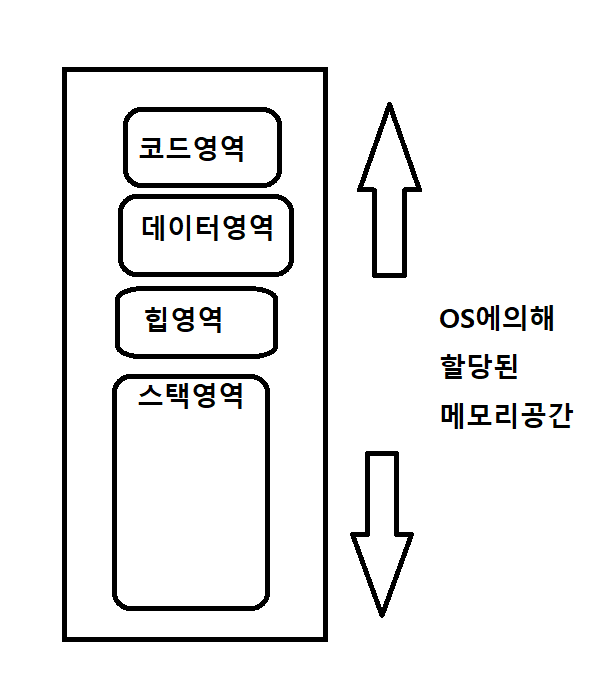
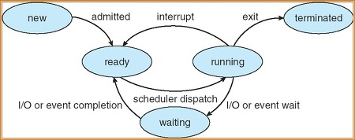
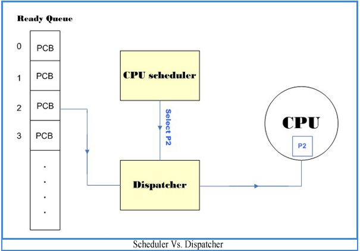
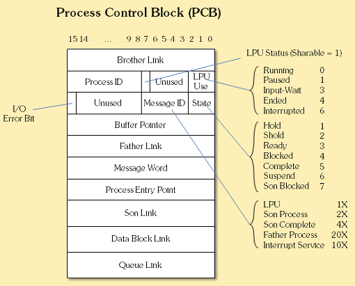
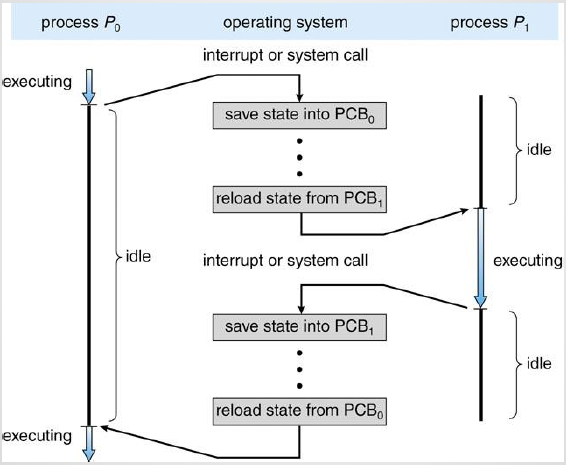

 # 프로세스를 알아보자

 우선 프로세스의 간단한 정의는 '실행중인 프로그램'이다.

 프로그램을 메모리에 적재하여 운영체제의 제어를 받는 상대가 되면 프로세스이다.

    프로그램 : 정적인 데이터
    프로세스 : 동적인 개체

# 사용자 관점의 프로세스의 메모리 구조

    사용자 관점에서의 프로세스는 주소 공간을 가지고 실행하는 프로그램을 뜻한다.

## 1. 코드 영역
+ 실행 할 프로그램의 코드가 저장되는 공간으로 CPU는 이 영역에 저장된 명령문을 가져간다
+ 읽기전용 이므로 프로그램이 코드영역을 침범하면 오류가 발생한다

## 2. 데이터 영역
+ 데이터는 프로그램의 가상 주소 공간이다.
+ 전역변수와 static변수가 할당된다 
+ 이 영역에 할당되는 변수들은 시작과 동시에 메모리 공간에 할당되며 프로그램이 종료할 때 까지 남아있는다
## 스택 영역

+ 데이터를 일시적으로 저장하는 영역이다.
+ 지역변수와 매개변수가 할당된다
+ 이 영역에 할당된 변수는 선언된 위치의 함수를 빠져나갈 경우 소멸된다

## 힙 영역

+ 알고리즘을 짜다보면 프로그래머가 원하는 시점에 변수를 할당하고 해제하고 싶을 때가 있다(주로 malloc과 free를 사용할 때)
+ 이 경우에 변수가 할당되는 영역이 힙 영역이다
+ 동적메모리를 할당한다
+ 코드 영역과는 별도로 유지되는 자유 영역

# 시스템 관점에서의 프로세스

+ 역할로 분류

    + 시스템(커널)프로세스
            
            모든 시스템 메모리와 프로세서의 명령에 액세스 할 수 있는 프로그램
            사용자 프로세스를 생성하는 기능을 한다

    + 사용자 프로세스

            사용자 코드를 수행하는 프로세스

+ 병행 수행 방법으로 분류

    + 독립 프로세스

            다른 프로세스와 영향을 주고 받지 않는다.

    + 협력 프로세스

            다른 프로세스와 영향을 주고 받는다

# 프로세스의 상태 변화와 상태 정보

프로세스는 시스템에서 준비, 실행, 대기 상태로 바뀌면서 실행하고 종료하는데 시스템을 떠날 때까지 반복한다.

프로세스의 상태 변화는 운영체제가 작업 스케줄러와 프로세스 스케줄러 같은 프로세서 스케줄러를 이용하여 관리한다.

+ ## 작업 스케줄러

    + 스풀러가 디스크에 저장한 작업 중 실행할 작업을 선정하고 준비 리스트에 삽입하여 다중 프로그래밍의 정도를 결정한다.

+ ## 프로세서 스케줄러

    

    1. 실행 상태의 프로세스가 프로세서를 자발적으로 반환하기 전에 할당된 시간이 지나면 이 프로세스는 준비 상태가 된다.

    2. 대기 상태의 프로세슨느 대기 원인을 제거하면 준비 상태로 바뀐다.

    3. 디스패처가 준비 상태인 프로세스에 프로세서를 할당하면 다시 실행 상태로 바뀐다.

+ ## 3번에 언급한 디스패처는 스케줄러가 선택한 프로세스에 프로세서를 할당하는 모듈이다.

    

+ ## 프로세스의 상태 변화

    + 준비 -> 실행 : 디스패치(dispatch)

        + 준비 큐 맨 앞에 있던 프로세스가 프로세서를 점유하는것
        + 다중프로그래밍 운영체제에서는...
            + 실행 상태인 프로세스는 할당된 시간만큼만 사용한다
            + 이로써 특정프로세스가 프로세서를 독점하는걸 방지한다

    + 실행 -> 준비 : 타임아웃(timeout)

        + 운영체제는 실행 상태의 프로세스가 프로세서를 계속 독점하지 않도록 인터럽트 클록을 두어 특정 프로세스가 할당된 시간 동안만 프로세서를 점유하게 한다.
        + 타임아웃되어도(일정시간이 지남) 프로세서를 반환하지 않으면 클록이 인터럽트를 발생시켜 운영체제에 프로세서 제어권을 부여한다.
        + 그리하면 실행 프로세스는 준비 상태가 되고 준비 리스트의 첫번째 프로세스가 실행 상태가 된다.

    + 실행 -> 대기 : 블록(block)

        + 할당된 시간 이전에 실행 상태의 프로세스에 
            + 입출력 연산
            + 새로운 자원 요청
        + 등의 문제로 프로세서를 스스로 양도하면 대기상태가 된다.

    + 대기 -> 준비 : wakeup

        + 프로세스는 입출력 작업이 끝나면 깨움으로 대기에서 준비 상태가 된다.

+ ## 프로세스 제어 블록

     프로세스를 제어할 때 필요한 프로세스 상태 정보는 프로세스 제어 블록에 저장된다

     + 프로세스 제어 블록

        + 특정 프로세스 정보를 저장하는 데이터 블록이나 레코드
        + '작업 제어 블록' 이라고도 한다.

    + 프로세스가 생성되면 프로세스 제어블록을 생성하고,
    + 프로세스가 종료되면 해당 프로세스 제어블록도 삭제한다

    다음 그림은 프로세스 제어블록에 들어가는 정보들이다

    

    영어로 되어 있어서 작성자가 알아보기 힘들다 

    근데 이거 교수님이 그냥 넘어가셔서 크게 자세하게 안봐도 된다.

+ ## 프로세스와 문맥 교환

    인터럽트와 시스템 호출 등으로
    
    실행 중인 프로세스의 제어를 다른 프로세스에 넘겨 실행 상태가 되도록 하는 것을
    
    문맥교환이라고 한다

    + 문맥교환이 일어나면...

            프로세서의 레지스터에 있던 내용을
            나중에 사용할 수 있도록 저장한다

    

