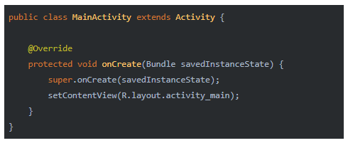
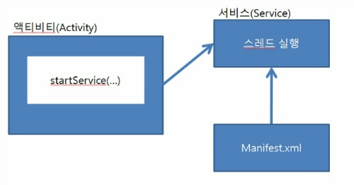
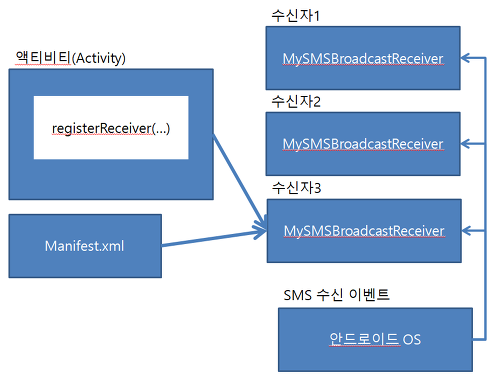
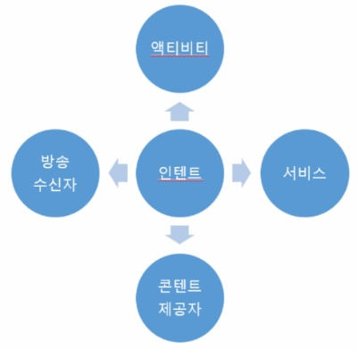
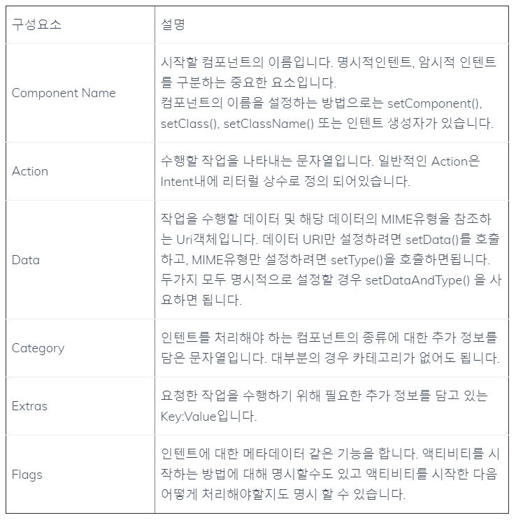
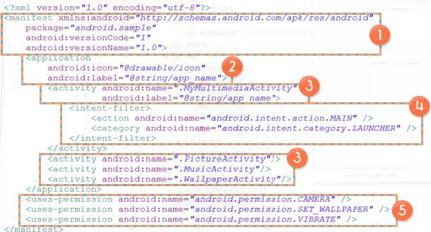

# 안드로이드

수업에서 언급한 것중에 기본적으로 꼭 알아야한다고 생각하는 것만 정리해놓았다

이론적인 내용만 정리했으니 실습은 알아서하자!!

# 목차

1. Android SDK
2. 안드로이드 4대 컴포넌트
3. Intent
4. Manifest
5. View, ViewGroup

## Android SDK

Android SDK는 Android Software Development Kit의 약자로

안드로이드 소프트웨어를 개발하기 위한 툴 킷을 의미한다

즉, 소프트웨어 개발 도구이다.

+ SDK에 포함된 것은...

    1. 안드로이드 API

            개발자들이 안드로이드 개발을 손쉽게 하도록 접근을 허용하는
            안드로이드 API들
    2. 안드로이드 응용 프로그램 개발에 필요한 각종 도구들

            안드로이드 소스 코드를 실행 가능한 어플리케이션으로 만들기 위한
            컴파일러나 에뮬레이터

    3. 샘플 코드들

            SDK를 사용하기 위한 각종 패키지나 클래스에 대한 설명

## 안드로이드 4대 컴포넌트

안드로이드 4대 컴포넌트는 다음과 같이 구분된다.

- Activity

    = View + Function

    = XML file + Java file

    *intent
        -Intent it = new Intent(...)
        -startActivity(it)
- Service
    =Function
- BR(Broadcast Receiver)
- CP(Content Provider)

이렇게 보면 하나도 알아보기 힘들다

좀 더 자세히 봐보자

### Activity

액티비티는 UI화면을 담당하는 컴포넌트이다.

자바소스에서 Activity클래스를 상속해야 사용이 가능하며 액티비티가 기본적으로 가진 생명주기 메소드를 재정의하여 원하는 기능을 구현하는 방식으로 제작한다.

+ 특징
    1. 안드로이드 어플리케이션은 반드시 1개이상의 액티비티를 가져야 한다.
    2. 두개의 액티비티를 동시에 Display할 수 없다.
    3. 다른 어플리케이션의 액티비티도 불러낼 수 있다.
    4. 액티비티 내에는 프래그먼트를 추가하여 화면을 분할시킬 수 있다. 

[액티비티 부분의 JAVA 코드]

### Service

서비스는 백그라운드에서 실행되는 프로세스를 의미한다.

서비스도 애플리케이션의 구성요소라 새로 만든 후에는 매니페스트에 등록을 해주어야한다.

메인 액티비티에서 서비스를 시작하려면 startService()라는 메서드를 사용해야한다.

+ 특징
    1. 화면이 없다. 그저 백그라운드에서 돌아가는 컴포넌트이다.
    2. 한번 시작된 서비스는 애플리케이션이 종료되어도 계속해서 백그라운드에 돌아간다.
    3. 모든 서비스는 Service클래스를 상속받아 사용한다.
    4. 네트워크를 통해서 데이터를 가져올 수 있다.

[서비스 컴포넌트 구성도]

### Content Provider

콘텐트 제공자는 데이터를 관리하고 다른 어플리케이션 데이터를 제공해주는 컴포넌트이다.

데이터베이스의 데이터를 전달할 때 많이 사용한다.

생명주기를 가지고 있지 않는다.

+ 특징
    1. 파일입출력, SQLiteDB, Web 등을 통해서 데이터를 관리한다.
    2. 콘텐트 제공자를 통하여 다른 어플리케이션의 데이터도 변경할 수 있다.

### Broadcast Receiver

안드로이드에서 다양한 이벤트와 정보를 받아 반응하는 컴포넌트이다.

브로드캐스팅은 메세지를 여러 객체에게 전달하는 방법을 의미하는데 이렇게 전달되는 브로드캐스팅 메세지를 방송수진자라는 어플리케이션의 구성요소를 이용해 받을 수 있다.

+ 특징
    1. 디바이스에서 발생하는 일 중에서 어플리케이션이 알아야하는 상황이 발생하면 알려준다.

    2. 수신기를 통해 디바이스의 상황을 감지하고 적절한 작업을 수행한다.

    3. 대부분 UI가 존재하지 않는다.

## Intent

인텐트는 컴포넌트간에 통신을 위한 메시지 객체이다

Intent를 사용하는 방법은 여러가지가 있지만 3가지를 꼽아보자면

+ 액티비티의 시작

    + startActivity(Intent)
    + startActivityForResult(Intent, requestCode)

+ 서비스의 시작

    + startService(Intent)
    + bindService(Intent)

+ 브로드케스트 전달

    + sendBroadcast(Intent)
    + sendOrderedBroadcast(Intent)
    + sendStickyBroadcast()

이렇게 된다 (서비스부분이랑 브로드케스트부분은 아직 굳이 외울필요 없다)

[Intent 메세지 전달 구성도]

### 인텐트 유형

인텐트 유형에는 명시적 인텐트와 암시적 인텐트가 있다

한번 살펴보자

+ 명시적 인텐트

    시작할 컴포넌트 이름을 지정한다.
    
    (예: new Intent(context, 클래스이름) 또는 Intent.setClass(context, 클래스이름) 등)

    일반적으로 본인이 만든 컴포넌트를 실행할 때 쓴다.

+ 암시적 인텐트

    특정 컴포넌트의 클래스명 없이 어떠한 작업을 수행할것인지만 선언한다.

    해당 인텐트를 처리할 수 있는 컴포넌트를 시스템이 필터링하여 수행하거나 사용자에게 선택하도록 한다.

## 인텐트에 포함된 기본사항

인텐트 객체에는 어느 컴포넌트를 시작할지 판별하는데 사용하는 정보가 담겨있다.

또한 인텐트를 받은 컴포넌트가 적절한 작업을 수행하기 위해 사용할 정보도 이안에 담겨있다.

기본 사항은 다음과 같다.

## Manifest

안드로이드 어플리케이션에 대한 각종 정보를 기술한 어플리케이션 명세서

모든 안드로이드 어플리케이션은 AndroidManifest.xml 파일을 자신의 루트 디렉토리에 가지고 있어야 한다.

AndroidManifest.xml 는 어플리케이션에 대한 필수적인 정보를 안드로이드 플랫폼에 알려준다.

### AndroidManifest.xml 에 기술되는 내용

- 안드로이드 어플리케이션을 위한 자바 패키지명 정의

- 이 패키지명은 전체 시스템 상으로 유일해야 한다.

- 안드로이드 어플리케이션을 구성하는 컴포넌트들(Activity, Service, Broadcast Receiver, Content Provider)을 기술해야 한다.

- 어플리케이션을 구성하는 Component들에 대한 해당 클래스명을 정의하고, 그 Component가 처리할 수 있는 기능이 무서인지 Intent-filter를 정의

    > 이를 통해 한 안드로이드 어플리케이션 안에 어떤 Component들이 존재하며, 어떤 조건에 해당 Component가 시작돼야 하는지 안드로이드 플랫폼이 알 수 있다.

- 안드로이드 어플리케이션이 안드로이드 플랫폼의 제한된 API에 접근하거나 다른 어플리케이션의 제한된 컴포넌트를 사용하기 위해서 필요한 권한을 설정

- 안드로이드 어플리케이션은 자신의 Component를 쉽게 사용할 수 없도록 권한을 설정할 수 있다.

- 안드로이드 어플리케이션 개발이나 테스트 단계에서 어플리케이션의 동작을 로깅이난 모니터링하기 위한 Instrumenttation 클래스를 설정

    > 개발 및 테스트가 끝나 실제로 사용하도록 배포시 이를 삭제해야 한다.

- 안드로이드 어플리케이션을 구동하기 위한 최소한의 SDK 버전을 정의

- 안드로이드 어플리케이션이 사용하는 다른 추가적인 라이브러리들을 정의

###  AndroidManifest.xml

기본적으로 AndroidManifest.xml은 루트 요소가 manifest이고, 그 자식으로 application 요소가 하나 존재한다.

- manifest

    안드로이드 어플리케이션의 패키지명과 버전정보(버전 이름과 버전 코드 등)를 정의

    여기서는 안드로이드 어플리케이션을 구성하는 자바 클래스들의 패키지명이 android.sample로 시작한다.

    버전 이름은 1.0 버전 코드는 1이다.

- application

    어플리케이션의 제목과 아이콘을 정의하고, manifest 밑에는 하나의 application만 정의된다.

    여기서는 안드로이드 어플리케이션 제목이 string 리소스에 있는 app_name 문자열 값으로 설정되어있다.

- activity

    안드로이드 어플리케이션을 구성하는 네가지 Component 중에 Activity를 정의하는 요소

    Activity 클래스명과 Activity의 제목을 정의할 수 있다.

    여기서는 네 가지 Activity인 MyMultimediaActivity, PictureActivity, MusicActivity, WallpaperActivity가 해당 안드로이드 어플리케이션에 존재하는 것을 알 수 있다.

- intent-filter

    해당 Component의 intent-filter를 가리키는 것으로, 해당 Component(Activity,Service,Broadcast Receiver 등)가 어떤 암시적 Intent를 처리할 수 있는지 정의

    intent-filter는 그 밑으로 action 요소를 정의하여 어떤 작업을 처리할 수 있는지 정의할 수 있다.

    category 요소를 정의하여 Component의 유형이 무엇인지 정의할 수 있다.

    여기에 설정된 intent-filter는 해당 Activity가 안드로이드 어플리케이션이 실행될 때 처음 시작되는 main Activity임을 정의하고 있다.

- uses-permission

    안드로이드 어플리케이션의 리소스접근 및 기능 사용 권한을 정의한다.

    여기서는 해당 어플리케이션이 카메라와 바탕화면 배경 그림 설정, 진동 기능을 사용할 수 있도록 권한을 설정하였다.