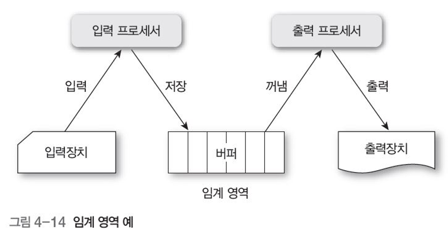
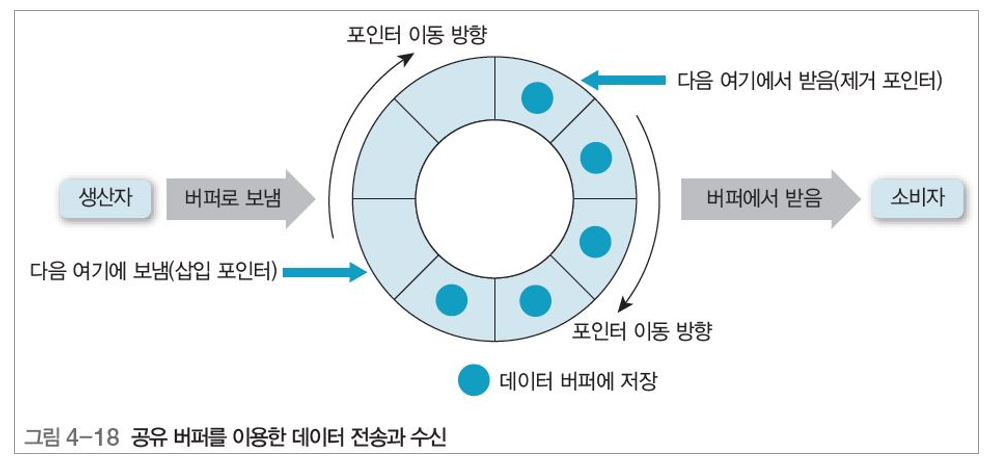
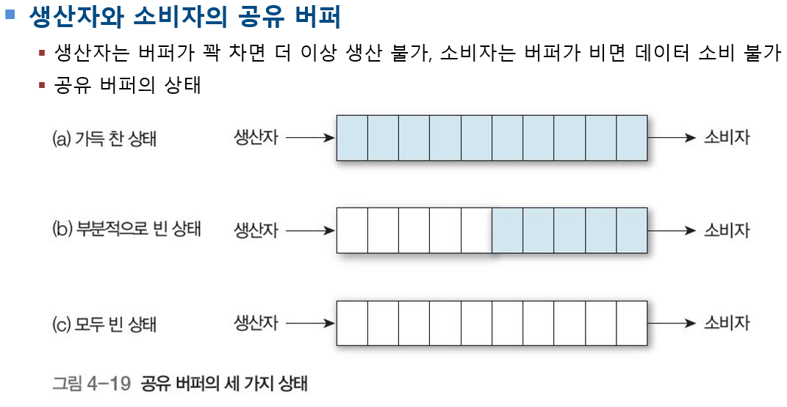
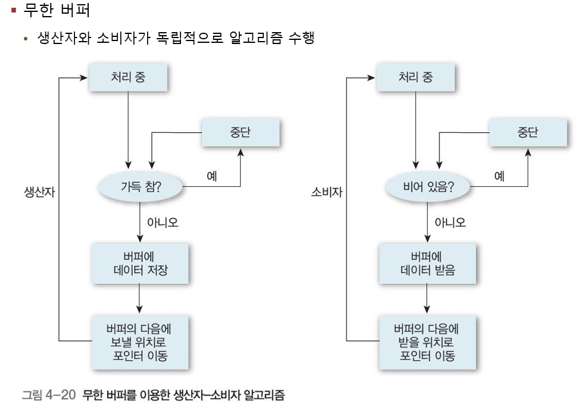
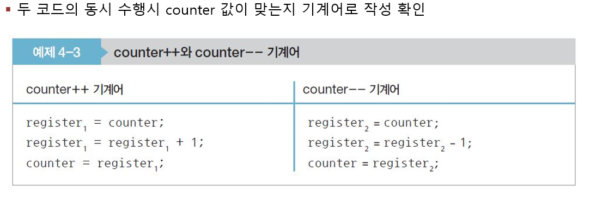
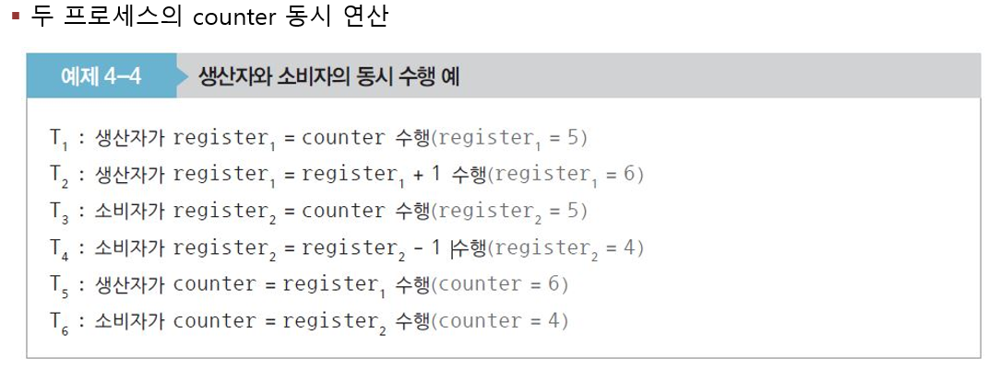

# 임계영역

+ 다수의 프로세스 접근 가능하지만 어느 한 순간에는 프로세스 하나만 사용 가능

## 병행 프로세스
프로세스하나가 동시의 작업을 처리함

## 비동기

겹쳐서 일어나므로 중첩이라고 번역을 하고 overlapped와 비슷한 단어이다.

## 임계 영역 이용한 상호배제

+ 간편하게 상호배제 구현 가능(자물쇠와 열쇠 관계)
    + 프로세스가 진입하지 못하는 임계 영역(자물쇠로 잠근 상태)
+ 어떤 프로세스가 열쇠 사용할 수 있는지 확인하려고 검사 하는 동작과 다른 프로세스
   + 사용 금지하는 동작으로 분류

## 병행 프로세스에서 영역 구분

위에 나오는 임계영역의 시스템에서 동기라는 시스템이 만들어진다.

+ 임계영역의 조건
    + 상호배제
        + 어떤 프로세스가 임계 영역에서 작업 중, 다른 프로세스 임계 영역 진입 불가 
    + 진행
        + 임계 영역에 프로세스가 없는 상태에서 어떤 프로세스가 들어갈지 결정 
    + 한정 대기
        + 다른 프로세스가 임계 영역을 무한정 기다리는 상황 방지 위해 임계 영역에 한 번 들어갔던 프로세스는 다음에 임계 영역에 다시 들어갈 때 제한
    + 이놈들은 외워라 시험문제에 나온덴다

## 생산자 소비자 문제

+ 운영체제에서 비동기적으로 수행하는 모델
+ 생산자 프로세스가 생산한 정보를 소비자 프로세스가 소비하는 형태

+ 라인프린터드라이버 >- 생산 -> 문자 >- 소비 -> 라인 프린터
+ 컴파일러 >- 생산 -> 어셈블러코드 - 소비 -> 어셈블러
+ 어셈블러 >- 생산 -> 적재모듈 >- 소비 -> 로더

+ 소비자가 데이터를 받을 준비를 마칠 때까지 생산자는 버퍼로 데이터 전송

[원형버퍼, 유한버퍼의 형태]

위에 그림에서는 부분적으로 빈 상태가 정상적인 상태이다

## 모두 빈 상태

생산자에서 데이터를 넣고 소비자에선 데이터가 들어올 때 까지 아무일도 안함

+ in : 넣는다
+ out : 뺀다

무한버퍼와 유한버퍼 꼭 알아두기

## 유한버퍼를 코드로 구성해보자

생산자코드 vs 소비자 코드

위의 사진에서 counter는 공유변수!

+ 컨텍스트스위칭
    + CPU에 있는 레지스터정보를 메모리의 레지스터정보로 바꿔서 실행한다
    + 실행이끝나고 그 레지스터정보가 메모리에 올라감

컨텍스트 스위칭이 일어나고 나서...

위의 사진은 동시 연산시 발생하는 예(저거 그대로 진행하면 아작남)

그리하여 나타난 것이 경쟁상태

# 경쟁상태

+ 경쟁 상태race condition

    + 경쟁상태의 개념 

        + 여러 프로세스가 동시에 공유 데이터에 접근 시, 접근 순서에 따라 실행 결과    달라지는 상황 말함.
        + 공유데이터에 마지막으로 남는 데이터의 결과 보장할 수 없는 상황
        + 장치나 시스템이 둘 이상의 연산 동시 실행 시, 어느 프로세스를 마지막으로 수행한 후 결과를 저장했느냐에 따라 오류가 발생하므로 적절한 순서에 따라 수행 해야 함
        + 읽기와 쓰기 명령을 거의 동시에 실행해야 한다면, 기본적으로 읽기 명령을 먼저 수행 후 쓰기 명령 수행하는 접근(이게 중요함)

    + 경쟁 상태의 예방
        + 병행 프로세스들을 동기화해야 함(임계 영역 이용한 상호배제로 구현)
        + 즉, 공유 변수 counter를 영역과 counter 연산하는 부분을 임계 영역으로 설정
            + 상호배제하는 방법으로 해결한 순간에 프로세스 하나만 조작

## 데커의 알고리즘

+ 두 프로세스가 서로 통신하려고 공유 메모리를 사용하여 충돌 없이 단일 자원(공유자원)을 공유할 수 있도록 하는 것
+ 다익스트라로 임계 영역의 문제에 적용
+ 병행 프로그래밍 상호배제 문제의 첫 번째 해결책
+ 각 프로세스 플래그 설정 가능, 다른 프로세스 확인 후 플래그 재설정 가능
+ 프로세스가 임계 영역에 진입하고 싶으면 플래그 설정하고 대기

윗사진 설명

flag = 상태를 설명함

1. flag[0]이 true이면
2. process1은 
3. while문은 임계영역의 진입여부를 확인함
4. 동기화(임계영역)에 넣고 싶은 코드는 3번에 넣음(사진속 3번)

+ turn == 1 은 진입할 차례가 된다는것을 한번더 확인함(context switching에 의해...)
+ 4번에 flag[0]이 false인 이유 
+ 5번은 빠른대기 
+ 6번은 flag[0]을 true로 설정하고 진짜로 임계영역에 들어감
+ 마지막에 false한 이유는 임계영역을 나가기직전이기 때문

프로세스 p1은 p2와 정반대

+ 데커의 알고리즘 특징
    + 특별한 하드웨어 명령문 필요 없음 
    + 임계 영역 바깥에서 수행 중인 프로세스가 다른 프로세스들이 임계 영역 진입 막지 않음 
    + 임계 영역에 들어가기를 원하는 프로세서 무한정 기다리게 하지 않음 

기타 유용한 상호배제 알고리즘(그냥 알아만 두자)

• 다익스트라dijkstra : 최초로 프로세스 n개의 상호배제 문제를 소프트웨어적으로 해결. 
                            실행 시간이 가 장 짧은 프로세스에 프로세서 할당하는 세마포 방법, 가장 짧은 평균 대기시간 제공
 
• 크누스knuth : 이전 알고리즘 관계 분석 후 일치하는 패턴을 찾아 패턴의 반복을 줄여서 프로세스에 프로세서 할당             
                   무한정 연기할 가능성을 배제하는 해결책을 제시했으나, 프로세스들이 아주 오래 기 다려야 함 

• 램포트lamport : 사람들로 붐비는 빵집에서 번호표 뽑아 빵 사려고 기다리는 사람들에 비유해서 만든 알고리즘
                     준비 상태 큐에서 기다리는 프로세스마다 우선순위를 부여하여 그중 우선순위가 가장 높은 프로세
                     스에 먼저 프로세서를 할당,‘램포트의 베이 커리(빵집) 알고리즘’이라고 함 

• 핸슨brinch hansen : 실행 시간이 긴 프로세스에 불리한 부분을 보완하는 것.대기시간과 실행 시간을 이용하는 모니터 
                         방법. 분산 처리 프로세서 간의 병행성 제어 많이 발표 

+ TestAndSet 명령어의 개념
    + 공유 변수 수정하는 동안 인터럽트 발생 억제하여 임계 영역 문제 간단 해결
    + 항상 적용할 수 없고 실행 효율 현저히 떨어짐
    + 소프트웨어적인 해결책은 더 복잡하고 프로세스가 2개 이상일 때는 더 많은 대기 가능성
    + 메모리 영역의 값에 대해 검사와 수정을 원자적으로 수행할 수 있는 하드웨어 명령어 
    + 알고리즘이 간단, 하나의 메모리 사이클에서 수행하여 경쟁 상황 해결
    + 기계명령어 2개(원자적연산 명령어 TestAndSet, TestAndSet에 지역변수 lock 설정명령어)
    + 일부 시스템에서 원자 명령어의 하나로, 읽기와 쓰기 모두 제공
    + 해당 주소의 값을 읽고 새 값으로 교체하면서 해당 메모리 위치의 이전 값 반환

+ 원자적 연산atomic operation(중요함)
    + 중단 없이 실행하고 중간에 다른 사람이 수정할 수 없는 최소 단위 연산. 메모리의 1비트에서 작동하고, 대다수 기계에서 워드의 메모리 참조, 할당은 원자적이지만 나머지 많은 명령은 원자적이지 않음
