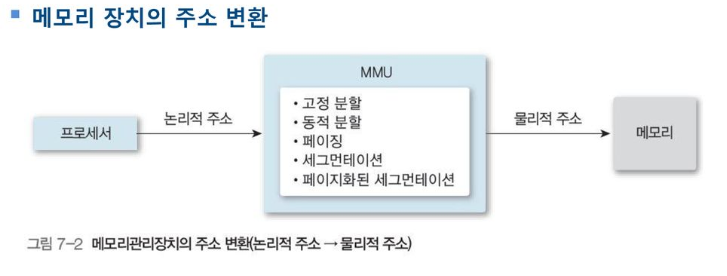

# 메모리 관리의 개념과 정책

메모리 관리 정책에는 3가지가 있다

+ 적재 정책

        디스크에서 메모리로 프로세스를 반입할 시기를 결정하는 것

    + 요구 적재
        
        + 운영체제나 시스템 프로그램, 사용자 프로그램 등 참조 요청에 따라 다음에 실행할 프로세스를 메모리에 적재하는 오래된 방법이다.

    + 예상 적재

        + 시스템의 요청을 미리 예측하여 메모리에 적재하는 방법

+ 배치 정책

    + 디스크에서 반입한 프로세스를 메모리 어느위치에 저장할 것인지 결정함

+ 대치 정책

    + 메모리가 충분하지 않을 때 현재 메모리에 적재된 프로세스 중 제거할 프로세스를 결정하는 교체 방법

# 메모리의 구조와 매핑(사상)

메모리를 관리하는 방법을 알아보려면 먼저 관리 대상이 되는 메모리의 구조를 이해해야 한다

명령어를 실행하는 과정에서 메모리는 주소의 연속으로

크게 두 가지 관점에서 해석할 수 있다.

+ 논리적 주소

    + 프로그래머가 프로그래밍에 사용하는 공간으로 보는 논리적 관점

    + 가상 주소라고도함

    + 목적 코드가 저장된 공간과 프로그램에서 사용하는 자료구조가 이에 해당

+ 물리적 주소

    + 실제 데이터나 프로그램을 저장하는 공간으로 보는 물리적 관점

    + 논리적 주소에 대응하여 적재하는 실제 주소

    + 메모리 칩이나 디스크 공간에서 만듬

논리적 주소와 물리적 주소의 변환은 메모리관리장치가 처리한다

논리적 주소를 물리적 주소로 연결해주는 작업을 '바인딩' 이라고 한다

여기서 바인딩을 컴파일 시간, 적재 시간, 실행 시간으로 구분할 수 있다.

# 메모리 관리 관련 용어

+ 동적 적재

+ 중첩

+ 스와핑 (프로세스 교체)

    + 스왑 아웃

        + 프로세서 할당이 끝나고 수행이 완료된 프로세스는 보조기억장치로 보낸다

    + 스왑 인

        + 새롭게 시작하는 프로세스는 메모리에 적재해야한다

    + 중기 스케줄링에 해당한다

    + OS가 항상 우선순위가 높은 프로세스 공간을 만들 수 있어서 유연성을 제공한다

    + 스와핑 과정은 바인딩 방법에 따라 다르다

+ 메모리 할당 방법

# 연속 메모리 할당

연속 메모리 할당은 메모리에 프로세스를 적재할 때 연속적으로 적재하는 방법을 뜻한다

## 단일 프로그래밍 환경에서 연속 메모리 할당

패쓰(시험에 안나올거 같음)

## 다중 프로그래밍 환경에서 연속 메모리 할당

### 고정 분할 방법

연속 메모리 할당에서는 메모리를 여러 개의 고정된 크기로 분할하고

분할된 각 메모리는 프로세스, 즉 작업 하나를 실행할 수 있다.

+ 논리적 주소가 분할된 메모리보다 크면 오류가 발생한다

+ 작으면 내부 단편화가 발생함

+ 프로그래밍의 성능이 분할 수에 제한을 받는다

### 가변 분할 방법

고정된 경계를 없애고 각 프로세스가 필요한 만큼 메모리를 할당하는 것을 가변 분할 방법이라한다

기준 레지스터와 경계 레지스터를 사용하여 각 프로세스(분할영역)을 나타낸다

+ 운영체제가 메모리의 어느 부분을 사용하고 사용할 수 있는지 알 수 있는 테이블을 유지해야한다

사용 가능 공간을 어느 작업에 할당하는 것이 좋은지 결정하는 일반적인 메모리 배치 방법으로는

최초 적합, 최적 적합, 최악 적합 등을 둘 수있다.

한번 알아보자

+ 최초 적합 방법

    프로세스를 사용 가능 공간 중 충분히 큰 첫번째 공간에 할당한다

    빨리찾을 수 있지만 공간활용도가 낮다

+ 최적 적합 방법

    프로세스를 사용 가능 공간 중 가장 작은 공간에 할당한다

    할당 과정은 느리지만 공간활용도가 높다

+ 최악 적합 방법

    프로세스를 가장 큰 사용 가능 공간에 할당한다

    최적 적합보다 메모리 활용 면에서 유용하다

가변 분할 방법은 외부단편화 문제가 발생할 수 있다

외부 단편화 문제를 해결하는 방법을 알아보자

+ 메모리 통합 방법

    하나의 작업이 끝났을 때 인접해있는 빈공간이 있는지 점검하여 한번에 합치는거다

+ 메모리 압축 방법

    메모리 내용을 적절히 움직여 사용가능공간을 큰 블록 하나로 만드는 것

## 다중 프로그래밍 환경의 버디 시스템

포기

# 페이징

작업을 크기가 동일한 페이지로 나눠 처리하는 방법

프로세스를 크기가 동일한 페이지로 나누고, 메인 메모리도 프레임이라는 고정 크기 블록으로 나눠 이 프레임에 페이지를 적재하는 방법

MMU를 이용하여 프로세스를 연속된 메인 메모리에 저장한다

    페이징 시스템 에서는 프로세스의 영역인 페이지를
    메인 메모리 영역인 프레임에 할당한다

    그러므로 프로그램을 실행하려면 다음 작업을 준비해야 한다

    1. 프로세스에 필요한 페이지를 결정하여 페이지 번호를 부여한다

    2. 메모리의 빈 프레임을 조사하여 프로세스를 적재할 위치를 파악한다.

    3. 프로세스의 페이지를 빈 프레임에 적재하도록 준비한다

