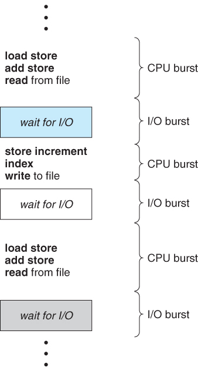

# 스케줄링의 개념

정의 : 여러 프로세스가 번갈아 사용하는 자원을 어떤 시점에 어떤 프로세스에 할당할지 결정하는 것

    스케줄링은 시스템의 성능에 영향을 미침

            ↓↓↓↓↓
    
    스케줄링 방법에 따라 프로세서를 할당받을 프로세스를 결정함
    좋은 스케줄링은 프로세서의 효율성을 높임
    작업의 응답시간을 최소화하여 시스템의 작업 처리 능력을 향상시킴

# 스케줄링의 목적

+ 자원 할당의 공정성 보장

+ 단위시간당 처리량 최대화

+ 적절한 반환시간 보장

+ 예측 가능성 보장

+ 오버헤드 최소화

+ 자원 사용의 균형 유지

+ 반환시간과 자원의 활용 간에 균형 유지

+ 실행 대기 방지

+ 우선순위

+ 서비스 사용 기회 확대

+ 서비스 수 감소 방지

# 스케줄링의 기준 요소

+ 프로세서 버스트
    
    + 프로세스를 프로세서에서 실행할 때

+ 입출력 버스트

    + 프로세스가 추가로 실행하려고 입출력을 기다리고 있을 때

프로세스는 입출력 버스트 후 다음 프로세서 버스트를 위해 [준비 큐]로 이동한다

그러므로 프로세스 실행은 [프로세서 버스트]와 [입출력 버스트]의 순환 형태로 구성된다.

프로세서 버스트는 입출력 대기시간에 따라 사용량이 결정됨

+ 프로세서 버스트는 지수 성질이 있다.

    + 프로세서 버스트가 짧은 프로세스가 많이 분포 되어있다.

    + 프로세서 버스트가 긴 프로세스는 매우 적다.

+ 긴 프로세서 버스트는 프로세서를 점유한 상태

    + 화면에서 모든 입력과 출력을 처리함

    + 파일에서 입력과 출력을 하지 않고 메모리와 레지스터에서 오랫동안 하는 작업

+ 백그라운드 프로그램은 일반적으로 파일 읽기와 쓰기를 한다.

+ 입출력 대기시간이 짧으면...

    + 프로세서를 오래 차지하여 프로세서 버스트가 길다

    + 프로세서 중심 작업

+ 입출력 대기시간이 길면...

    + 오히려 입출력을 하려고 오래기다리므로 프로세서 버스트가 짧다

    + 입출력 중심 작업

# 스케줄링의 단계

+ 1단계 작업 스케줄링 : 작업 선택

    + 시스템 자원을 사용할 작업을 결정하는 작업 스케줄링

+ 2단계 작업 승인과 프로세서 결정 스케줄링 : 사용 권한 부여

    + 프로세서를 사용할 권한을 부여할 프로세스를 결정하는 작업 승인

    + 프로세서 할당 스케줄링

    + 중기 스케줄링에 해당함

    + 메모리 사용성도 높이고 작업의 효율성을 향상시키는 스와핑기능의 일부로 이해할 수 있다.

+ 3단계 프로세서 할당 스케줄링 : 준비 상태의 프로세스에 프로세서 할당

    + 디스패처가 준비 상태에 있는 프로세스 중에서 프로세서를 할당할 프로세스를 결정하는 프로세스 할당 스케줄링

    + 다음에 실행할 프로세스 결정이 잦아 수행빈도가 많아 단기 스케줄링에 해당함

# 스케줄링 큐

스케줄링에서는 다양한 큐를 사용한다.

먼저 준비 큐에 대해 알아보자

+ 준비큐

    + 프로세서를 할당받아 실행하려고 기다리는 프로세스들이 대기한 곳

좁은 의미에서 스케줄링은 준비 큐에서 프로세스를 하나 선택하는 것

입출력장치 큐 - 입출력장치를 사용하려는 프로세스들이 대기함

하지만 디스크와 같이 공유할 수 있는 장치는 입출력장치 큐에 여러 프로세스가 대기할 수 있다.

# 스케줄링과 스케줄러

