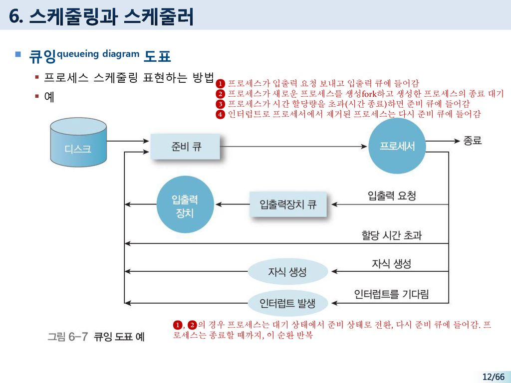
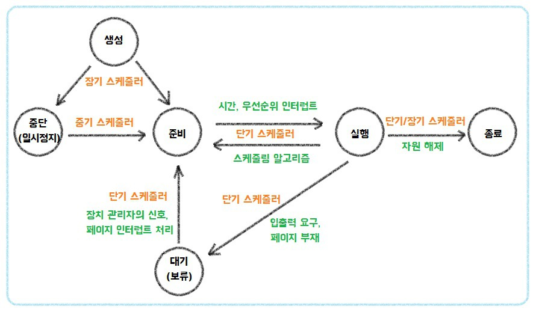
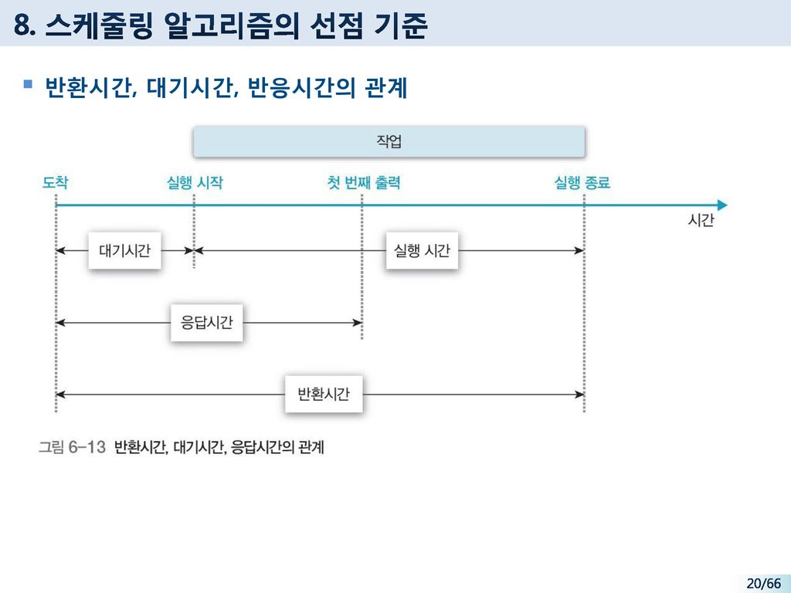

# 스케줄링의 개념

정의 : 여러 프로세스가 번갈아 사용하는 자원을 어떤 시점에 어떤 프로세스에 할당할지 결정하는 것

    스케줄링은 시스템의 성능에 영향을 미침

            ↓↓↓↓↓
    
    스케줄링 방법에 따라 프로세서를 할당받을 프로세스를 결정함
    좋은 스케줄링은 프로세서의 효율성을 높임
    작업의 응답시간을 최소화하여 시스템의 작업 처리 능력을 향상시킴

# 스케줄링의 목적

+ 자원 할당의 공정성 보장

+ 단위시간당 처리량 최대화

+ 적절한 반환시간 보장

+ 예측 가능성 보장

+ 오버헤드 최소화

+ 자원 사용의 균형 유지

+ 반환시간과 자원의 활용 간에 균형 유지

+ 실행 대기 방지

+ 우선순위

+ 서비스 사용 기회 확대

+ 서비스 수 감소 방지

# 스케줄링의 기준 요소

+ 프로세서 버스트
    
    + 프로세스를 프로세서에서 실행할 때

+ 입출력 버스트

    + 프로세스가 추가로 실행하려고 입출력을 기다리고 있을 때

프로세스는 입출력 버스트 후 다음 프로세서 버스트를 위해 [준비 큐]로 이동한다

그러므로 프로세스 실행은 [프로세서 버스트]와 [입출력 버스트]의 순환 형태로 구성된다.

프로세서 버스트는 입출력 대기시간에 따라 사용량이 결정됨

+ 프로세서 버스트는 지수 성질이 있다.

    + 프로세서 버스트가 짧은 프로세스가 많이 분포 되어있다.

    + 프로세서 버스트가 긴 프로세스는 매우 적다.

+ 긴 프로세서 버스트는 프로세서를 점유한 상태

    + 화면에서 모든 입력과 출력을 처리함

    + 파일에서 입력과 출력을 하지 않고 메모리와 레지스터에서 오랫동안 하는 작업

+ 백그라운드 프로그램은 일반적으로 파일 읽기와 쓰기를 한다.

+ 입출력 대기시간이 짧으면...

    + 프로세서를 오래 차지하여 프로세서 버스트가 길다

    + 프로세서 중심 작업

+ 입출력 대기시간이 길면...

    + 오히려 입출력을 하려고 오래기다리므로 프로세서 버스트가 짧다

    + 입출력 중심 작업

# 스케줄링의 단계

+ 1단계 작업 스케줄링 : 작업 선택

    + 준비큐에 꺼내 메모리에 적재

    + 시스템 자원을 사용할 작업을 결정하는 작업 스케줄링

+ 2단계 작업 승인과 프로세서 결정 스케줄링 : 사용 권한 부여

    + 연결

    + 프로세서를 사용할 권한을 부여할 프로세스를 결정하는 작업 승인

    + 프로세서 할당 스케줄링

    + 중기 스케줄링에 해당함

    + 메모리 사용성도 높이고 작업의 효율성을 향상시키는 스와핑기능의 일부로 이해할 수 있다.

+ 3단계 프로세서 할당 스케줄링 : 준비 상태의 프로세스에 프로세서 할당

    + 메모리에 꺼내 프로세서에 할당

    + 디스패처가 준비 상태에 있는 프로세스 중에서 프로세서를 할당할 프로세스를 결정하는 프로세스 할당 스케줄링

    + 다음에 실행할 프로세스 결정이 잦아 수행빈도가 많아 단기 스케줄링에 해당함

# 스케줄링 큐

스케줄링에서는 다양한 큐를 사용한다.

먼저 준비 큐에 대해 알아보자

+ 준비큐

    + 프로세서를 할당받아 실행하려고 기다리는 프로세스들이 대기한 곳

좁은 의미에서 [스케줄링은 준비 큐에서 프로세스를 하나 선택하는 것]

입출력장치 큐 - 입출력장치를 사용하려는 프로세스들이 대기함

하지만 디스크와 같이 공유할 수 있는 장치는 입출력장치 큐에 여러 프로세스가 대기할 수 있다.

# 스케줄링과 스케줄러

운영체제는 다양한 스케줄러를 이용하여 지원함

여기선 스케줄러의 종료, 프로세스 변화 과정에서의 스케줄러 역할을 다룸

여기서 큐잉도표가 대표적인 방법임

큐잉도표를 설명하고 다른 대표적인 스케줄러를 알려주겠음

## 큐잉도표

우선 큐잉도표는 스케줄링을 표현하는 방법임

+ 큐(준비큐 or 입출력장치큐)는 사각형

+ 자원은 원으로

+ 프로세스의 흐름은 화살표로 표시함

위의 예시를 보면

    작업이 시스템에 들어오면 작업의 프로세스 제어 블록을 생성한다.
    이는 작업을 종료할 때까지 갱신된다.
    실행 준비가 된 프로세스가 준비 큐에 들어가고 프로세서를 할당받을 때 까지 대기한다.

+ 프로세스가 입출력 요청을 보내고 입출력 큐에 들어간다.

+ 프로세스가 새로운 프로세스를 생성하고 생성한 프로세스의 종료를 기다린다.

+ 프로세스가 시간 할당량을 초과하면 준비 큐에 들어간다.

+ 인터럽트로 프로세서에서 제거된 프로세스는 다시 준비 큐로 들어간다.

# 스케줄러의 종류와 역할

운영체제는 다양한 스케줄러로 지원한다

주로 '장기 스케줄러'와 '단기 스케줄러'를 사용한다

## 장기 스케줄러

+ 작업 스케줄러라고도한다.

+ 스케줄링에 따라 디스크에서 메모리로 작업을 가져와 처리할 순서를 결정한다.

+ 작업 스케줄링에 필요한 정보로 제출 시간, 작업 이름, 길이(용량)이 있다.

+ 프로세스 제어 블록을 부착시켜 메모리를 적재한 것이 프로세스이다.

## 단기 스케줄러

+ 메모리에 적재된 프로세스 중 프로세서를 할당하여 실행 상태가 되도록 결정하는 프로세스 스케줄링을 한다.

+ 프로세스가 실행하는데 필요한 자원의 요청을 만족해야한다.

+ 디스패처를 포함할 수 있다.

_

    장기스케줄러와 단기스케줄러의 가장 큰 차이점은 실행빈도

    -   단기 스케줄러는 실행할 프로세스를 수시로 선택해서
        실행빈도가 많고 매우 빨라야한다

    -   장기 스케줄러는 시스템에 새로운 작업이 분단위로 들어온다
        그러므로 단기 스케줄러에 비해 상대적으로 드물게 수행된다
        장기 스케줄러는 다중 프로그래밍의 정도를 결정한다.
        작업의 도착률과 작업을 마치고 나가는 정도가 같다. 

    프로세서 중심 작업과 입출력 중심 작업을 적절히 혼합해야
    시스템의 성능을 높일 수 있다.

## 중기 스케줄러

어떤 시스템에서는 장기 스케줄러가 없거나 역할이 매우 적다

예를 들면 시분할 시스템은 장기 스케줄러가 없고 새로운 프로세스를 메모리에 넣기만 한다.

특히 가상 메모리 체제나 시분할 방법을 사용하는 시스템은 중기 스케줄러를 추가로 사용한다.

+ 중기 스케줄러의 핵심은 스왑이다 스왑에 대해서 알아보자

    + 과정

        + 프로세스들이 프로세서를 서로 차지하려고 할 때 

        + 프로세스를 별도의 기억장소에서 뺴낼 수 있어 다중프로그래밍의 정도를 줄인다

        + 시간이 흐른 후 빼넨 프로세스는 다시 메모리에 들어가 실행을 중단했던 곳부터 다시 실행한다

    + 장점

        + 작업의 혼합을 개선
        
        + 프로세스가 가지고 있던 메모리를 사용할 수 있게 하는데 필요함

스왑 인과 스왑 아웃을 중기 스케줄러가 결정한다

# 선점 스케줄링과 비선점 스케줄링

기준

    실행중인 작업이나 프로스를 실행중 중단할 것인가?

+ 비선점 스케줄링의 경우

    + 한 프로세스가 자원을 선택했을 때 다른 프로세스가 자원을 빼앗을 수 없는 경우

    + 실행 시간이 짧은 프로세스가 실행 시간이 긴 프로세스를 기다리는 대신 모든 프로세서를 공정하게 관리함

    + 우선순위가 높은 프로세스를 중간에 입력해도 대기중인 프로세스는 영향을 받지않아 응답시간을 예측하기 쉽다

+ 선점 스케줄링의 경우

    + 현재 실행중인 프로세스를 인터럽트 할 수 있거나 준비 상태로 이동할 수 있는 경우

    + 프로세스 하나가 장시간 프로세서를 독점하는걸 방지할 수 있음

    + 대화식 시분할 시스템, 실시간 시스템과같은 빠른 응답시간을 유지하는 곳엔 필수

    + 오버헤드가 커질 수 있어 메모리에 프로세스가 많이 적재되어야 효과적으로 사용이 가능함

    + 우선순위라는 개념을 반드시 고려해야한다

# 스케줄링 알고리즘 선택 기준

+ 프로세서 사용률

    + 프로세서를 항상 실행 상태로 유휴상태가 되지 않도록 해야함

    + 입출력 중심 작업보다는 프로세서 중심 작업을 실행한다

+ 처리율

    + 단위시간당 완료하는 작업 수가 많도록 짧은 작업을 우선 처리함

+ 반환시간

    + 소요되는 시간을 최소화하도록 일괄 처리 작업을 우선 처리함

+ 대기시간

    + 준비 큐에서 기다리는 시간을 최소화하도록 사용자 수를 제한한다

+ 반응시간

    + 작업을 요청한 시간부터 반응을 시작하는 시간까지의 간격

    + 대화식 작업을 우선 처리하고 일괄 처리 작업은 대화식 작업을 요청하지 않을 때 처리함

# 스케줄링 알고리즘

# 선입선처리 스케줄링

비선점 방법으로 프로세서 스케줄링 알고리즘 중 가장 단순함

프로세서를 요청하는 순서대로 프로세서를 할당함

시스템에 새로운 프로세스가 들어오면 준비 큐의 마지막에 해당 프로세스의 PCB를 연결함

대부분 성능이 좋지 않고 평균 대기시간이 길 때도 있다

+ 장점

    + 스케줄링의 이해와 구성이 단순함

    + 준비 큐에 있는 모든 프로세스가 결국 실행되므로 기아 없는 공정한 정책이다.

    + 프로세서가 지속적으로 유용한 프로세스를 수행하여 처리율이 높다

+ 단점

    + 비선점식으로 대화식 프로세스에는 부적합하다.

    + 장기 실행 프로세스가 뒤의 프로세스를 모두 지연시켜 평균 대기시간이 길어질 수 있다

    + 긴 프로세스가 실행되는 동안 짧은 프로세스가 긴 대기시간을 가지게 될 수 있다

# 최소작업 우선 스케줄링

짧은 대기시간을 가진 프로세스가 먼저 실행되도록 하는 스케줄링

+ 장점

    + 항상 실행 시간이 짧은 작업을 신속하게 실행하므로 평균 대기시간이 가자 짧다

+ 단점

    + 초기의 긴 작업을 종료할 때까지 대기시켜 기아가 발생한다

    + 실행시간을 예측하기 어려워 실용적이지 못하다

    + 짧은 작업이 항상 먼저 실행되도록 설정되어 불공정한 작업을 실행한다

# 우선순위 스케줄링

우선순위를 부여해서 우선순위가 높은 프로세서에 먼저 할당한다

우선순위가 동일하면 선입선처리 순서로 스케줄링함

+ 장점

    + 각 프로세스의 상대성 중요성을 정확히 정의할 수 있어 좋다

    + 다양한 반응으로 실시간 시스템에 사용 가능하다

+ 단점

    + 높은 우선순위 프로세스가 프로세서를 많이 사용하면 우선순위가 낮은 프로세스는 무한정 연기되는 기아가 발생할 수 있다

# 라운드 로빈 스케줄링

특별히 시분할 시스템을 위해 설계한 스케줄링

규정시간량을 최대로하여 순환하는 스케줄링

준비큐는 FIFO큐로 되어 있다

+ 장점

    + 모든 프로세스가 프로세서의 동일한 점유율과 제한된 대기시간으로 공정하며 기아가 발생하지 않는다

    + 실행 큐에 프로세스 수를 알고 있을 때 구현이 용이하다

    + 강한 상호작용과 프로세스의 짧은 응답시간, 특히 프로세스 최악의 응답시간을 알 수 있다.

    + 평균 대기시간이 비교적 적다

+ 단점

    + 성능은 규정 시간량의 길이에 따라 달라지므로 작업이 비슷한 길이가 좋다

    + 하드웨어 타이머가 필요하다

    + 미완성 작업은 규정 시간량을 마친 후 프로세서를 기다리므로 평균 처리 시간이 높다

# 다단계 큐 스케줄링

각 작업을 서로 다른 묶음으로 분류할 수 있을 때 사용함

전면작업과 후면작업으로 분류

전면작업 -  라운드 로빈 스케줄링

후면작업 - 선입선처리 스케줄링

+ 장점

    + 응답이 빠르다

+ 단점

    + 여러 준비 큐와 스케줄링 알고리즘 때문에 추가 오버 헤드가 발생한다

    + 우선순위가 낮은 큐의 프로세스는 무한정 대기하는 기아가 발생할 수 있다

# 다단계 피드백 큐 스케줄링

작업이 시스템에 들어가면 한 큐에서만 고정되는 다단계 큐 스케줄링과 다르게

전면작업과 후면작업에 독립된 큐가 있어도 작업이 큐 사이를 이동할 수 있다

# HRM스케줄링

포기

