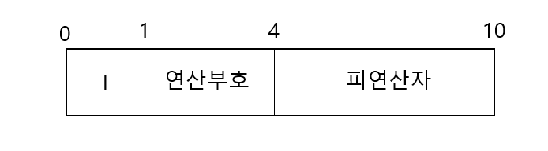
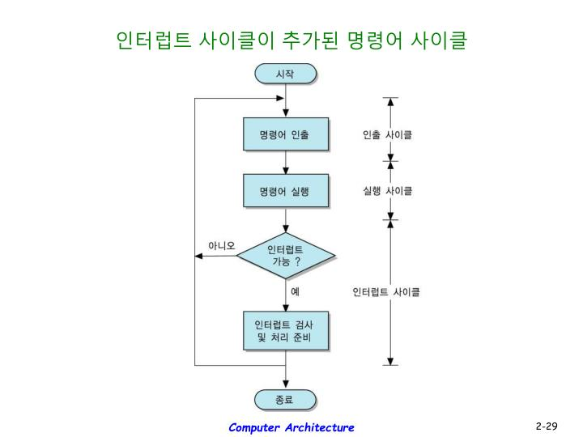

# 컴퓨터 시스템의 동작

우선 컴퓨터 시스템으로 작업을 처리할 시에 동작하는 순서는 이렇다.

1. 입력장치로 정보를 입력받아 메모리에 저장한다.

2. 메모리에 저장한 정보를 프로그램 제어에 따라 인출하여 연산장치에서 처리한다.

3. 처리한 정보를 출력장치에 표시하거나 보조기억장치에 저장한다.

여기서 입력장치로 컴퓨터에 유입되는 정보는 명령어와 데이터로 분류한다.

자, 여기서 명령어의 정의를 알아보자

### 명령어

    실행할 산술, 논리 연산의 동작을 명시하는 문장

대충 이런데 한가지 알아야할 점은 프로그램은 컴파일러 등을 이용하여 0과 1로 이진화된 기계 명령어로 변환해야 컴퓨터가 이해할 수 있다. 이번엔 명령어를 어떻게 구성하고 어떤 과정을 거쳐 수행하는지 알아보자

## 명령어의 구조

명령어의 기본구조는 이렇다.

1. 연산부호

        프로세서가 실행할 연산을 지정함
        산술연산,논리연산,시프트,보스 등 연산을 정의함
        연산 부호가 n비트이면 최대 2의 n승개 연산이 가능

2. 피연산자

        명령어가 처리할 데이터, 데이터를 저장한 레지스터나 메모리주소
        보통 데이터 자체보다는 데이터의 위치를 저장함

우선 명령어는 프로세서에 따라 고정 길이나 가변길이를 구성한다.

연산 부호는 특별한 경우가 아니면 한 개이나 피연산자는 여러 개일 수 있다.

    TIP
    명령어는 실행전에 메인메모리에 저장
    한번에 하나씩 프로세서에 순차적으로 전송함
    명령어는 피연산자를 여러 개 포함이 가능
    피연산자 수에 따라 주소 명령어를 구분함

## 모드 비트를 추가한 명령어의 형식을 알아보자

그전에 직접주소와 간접주소를 알아보자

1. 직접주소
        
        피연산자에 데이터가 있는 레지스터나 메모리 주소를 지정

2. 간접 주소

        데이터가 있는 레지스터나 메모리 주소 정보를 지정

이로써 잘 알아보았다

우선 모두 비트를 추가한 명령어 형식은 이렇다

보면 알겠지만 모드가 1비트, 연산부호가 3비트, 피연산자가 6비트 이다.

직접주소와 간접주소는 모드의 상태에 따라 다르다

+ 만약 모드가 1이라면 간접주소
+ 만약 모드가 0이라면 직접주소

이렇게 된다.

    TIP
    직접주소일 경우 피연산자가 번지수를 나타내고
    간접주소일 경우 피연산자가 실제 데이터를 저장하고 있는 주소이다.

    여기서 알아야할것은
    간접주소는 데이터의 주소를 읽을 때 한번,
    데이터를 읽을 때 한번 총 두번 메모리를 참조한다.

## 명령어의 실행

명령어는 다음 과정을 거쳐 실행한다.

    1. 명령어 인출
    2. 명령어 해석, 프로그램 카운터 변경
    3. 피연산자 인출
    4. 명령어 실행
    5. 결과 저장
    6. 다음 명령어로 이동[1단계부터 다시시작한다]

그럼 이제 각 사이클에서 뭐하는지 자세하게 좀 알아볼까?

뾰로롱!!

## 인출 사이클

인출 사이클은 명령어 실행 사이클의 첫 번째 단계인데 하는 일은 이렇다

    메모리에서 명령어를 읽어 명령어 레지스터에 저장하고,
    다음 명령어를 실행하려고 프로그램 카운터를 증가시킨다.

일단 작성자가 피곤하다

더 자세한건 나중에 업데이트 하겠다

## 실행 사이클

실행 사이클은 인출한 명령어를 해독하고 그 결과에 따라 제어신호를 발생시켜 명령어를 실행한다.

이단계에서 소비되는 시간을 실행 시간이라고한다.

## 간접 사이클

직접 주소 지정 방법을 사용하는 실행 사이클은 명령어를 즉시 수행한다.

하지만 말이다!!

간접 주소 지정 방법을 사용하는 실행 사이클은 명령어를 수행하기전에 실제 데이터가 저장된 주기억 장치의 주소인 유효 주소를 한 번 더 읽어 온다.

세부동작은 작성자가 피곤해서 나중에,,

## 인터럽트 사이클

인터럽트는 프로세서가 프로그램을 수행하는 동안 컴퓨터 시스템의 내부나 외부에서 발생하는 예기치 못한 사건을 의미한다.

-->여기서 인터럽트 명령어는 현재 실행중인 프로그램을 중단하고 다른 프로그램의 실행을 요구하는 명령어이다.